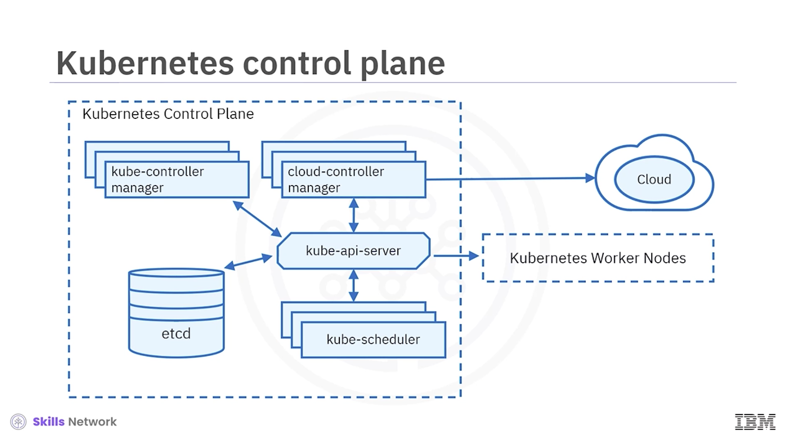

# Kubernetes Architecture

<figure><figcaption></figcaption></figure>

After watching this lesson, you will be able to:

* Identify the components of a Kubernetes architecture.
* Identify the components of a control plane.
* Identify the components of a worker plane.

A deployment of Kubernetes is called a **Kubernetes cluster**. A Kubernetes cluster is a cluster of nodes that runs containerized applications.

Each cluster has one master node, the Kubernetes control plane, and one or more worker nodes.

```
                         Kubernetes Cluster
                                |
                +---------------+---------------+
                |                               |
        Kubernetes Control Plane          Worker Nodes
                |                               |
        Global cluster decisions       Run user applications
                |                               |
        +-------+-------+-------+       +-------+-------+
        |       |       |       |       |       |       |
      API     etcd  Scheduler Controllers  Pods  Kubelet
     Server          |                |      |       |
        |            |                |   Containers |
        |            |                |      |       |
        +------------+----------------+      +-------+
```

## Kubernetes Cluster

A Kubernetes cluster:

* Is a deployment of Kubernetes.
* Is a cluster of nodes.
* Runs containerized applications.

| Cluster component  | Role                                                        |
| ------------------ | ----------------------------------------------------------- |
| Control plane      | Maintains intended cluster state and makes global decisions |
| Worker nodes       | Run user applications                                       |
| Nodes collectively | Provide the machines on which workloads execute             |

## Control Plane

<div align="left"><figure><figcaption></figcaption></figure></div>

The control plane maintains the intended cluster state by:

* Making decisions about the cluster.
* Detecting events in the cluster.
* Responding to events in the cluster.

### Thermostat Analogy

The control plane is similar to a thermostat:

1. You specify the desired temperature.
2. The thermostat continuously regulates heating and cooling systems.
3. The system works continuously toward the specified state.

```
Desired Cluster State
        ↓
   Control Plane
        ↓
Continuously evaluates cluster
        ↓
Takes necessary actions
        ↓
Actual State approaches Desired State
```

Examples include:

* Scheduling workloads.
* Creating new resources when an application is deployed.

## Worker Nodes

<div align="left"><figure><figcaption></figcaption></figure></div>

Nodes are the worker machines in a Kubernetes cluster.

* User applications run on nodes.
* Nodes are not created by Kubernetes itself, but rather by the cloud provider.
* This allows Kubernetes to run on a variety of infrastructures.
* Nodes are managed by the control plane.
* Nodes can be virtual or physical machines.
* Nodes contain the services necessary to run applications.

```
Cloud Provider
      ↓
Worker Nodes
      ↓
Managed by Kubernetes Control Plane
      ↓
Run User Applications
```

## Control-Plane Components

The main control-plane components are:

* Kubernetes API server
* `etcd`
* Kubernetes scheduler
* Kubernetes controller manager
* Cloud controller manager

### Kubernetes API Server

<figure><figcaption></figcaption></figure>

The Kubernetes API server:

* Exposes the Kubernetes API.
* Serves as the front end for the control plane.
* Enables all communication in the cluster.

The API server accepts commands to:

* View the state of the cluster.
* Change the state of the cluster.

The main implementation of the Kubernetes API server is:

```
kube-api-server
```

It is designed to scale horizontally by kube-instances. You can run several instances of `kube-api-server` and balance traffic between those instances.

```
                    Kubernetes API
                         |
             +-----------+-----------+
             |                       |
      kube-api-server          kube-api-server
             |                       |
             +-----------+-----------+
                         |
              Balanced API traffic
```

### `etcd`

<figure><figcaption></figcaption></figure>

`etcd` is a highly available, distributed key-value store that contains all the cluster data.

When you tell Kubernetes to deploy an application, that deployment configuration is stored in `etcd`.

`etcd` defines the state in a Kubernetes cluster, and the system works to bring the actual state to match the desired state.

```
Desired State
     ↓
Stored / represented in cluster state
     ↓
Control Plane
     ↓
Actual State
     ↓
System continuously works to match
     ↓
Desired State == Actual State
```

### Kubernetes Scheduler

<figure><figcaption></figcaption></figure>

The Kubernetes scheduler assigns newly created Pods to nodes.

It determines where workloads should run within the cluster and selects the most optimal node according to:

* Kubernetes scheduling principles.
* Configuration options.
* Available resources.

```
New Pod
  ↓
Kubernetes Scheduler
  ↓
Evaluate:
  - Scheduling principles
  - Configuration options
  - Available resources
  ↓
Select optimal node
  ↓
Pod assigned to node
```

### Kubernetes Controller Manager

<figure><figcaption></figcaption></figure>

The Kubernetes controller manager:

* Runs all controller processes.
* Monitors the cluster state.
* Ensures the actual state matches the desired state.

```
Desired State
     ↓
Controller Manager
     ↓
Monitor Cluster State
     ↓
Compare Actual vs Desired
     ↓
Take corrective action
     ↓
Actual State approaches Desired State
```

### Cloud Controller Manager

<figure><figcaption></figcaption></figure>

The cloud controller manager runs controllers that interact with underlying cloud providers.

These controllers effectively link clusters into a cloud provider's API.

Kubernetes is open source and intended to be adopted by a variety of cloud providers and organizations. Kubernetes strives to be as cloud-agnostic as possible.

The cloud controller manager allows Kubernetes and cloud providers to evolve freely without introducing dependencies on one another.

```
Kubernetes
    |
    | Cloud Controller Manager
    |
    +-----------------------------+
    |                             |
Cloud Provider A             Cloud Provider B
    |                             |
 Provider API                 Provider API
```

## Worker Plane

The worker plane consists of:

* Nodes
* Kubelet
* Container runtime
* Kubernetes proxy

```
Worker Node
├── Kubelet
├── Container Runtime
├── Kubernetes Proxy
└── Pods
    └── One or more containers
```

## Pods

Pods are the smallest deployment entity in Kubernetes.

* Pods include one or more containers.
* Containers share all the resources of the node.
* Containers can communicate among themselves.

```
Node
  ↓
Pod
  ├── Container
  ├── Container
  └── ...
```

## Kubelet

The kubelet is the most important component of a worker node.

The kubelet:

* Communicates with the Kubernetes API server.
* Receives new and modified Pod specifications.
* Ensures Pods and associated containers are running as desired.
* Reports Pod health and status to the control plane.

```
Kubernetes API Server
        ↓
       Kubelet
        ↓
Receive new / modified Pod specifications
        ↓
Ensure Pods and containers run as desired
        ↓
Report health + status
        ↓
Control Plane
```

When starting a Pod, the kubelet uses the container runtime.

```
Kubelet
   ↓
Container Runtime
   ↓
Download images
   ↓
Run containers
   ↓
Pod starts
```

## Container Runtime

The container runtime is responsible for:

* Downloading images.
* Running containers.

Rather than providing a single container runtime, Kubernetes implements a **Container Runtime Interface** that permits pluggability of the container runtime.

```
                Container Runtime Interface
                         |
          +--------------+--------------+
          |              |              |
       Runtime A      Runtime B      Runtime C
          |              |              |
       Containers      Containers    Containers
```

The lesson names these container runtimes:

| Runtime | Description                     |
| ------- | ------------------------------- |
| Docker  | Likely the best known runtime   |
| Podman  | Commonly used container runtime |
| Creo    | Commonly used container runtime |

## Kubernetes Proxy

The Kubernetes proxy is a network proxy that runs on each node in a cluster.

It:

* Maintains network rules.
* Allows communication to Pods running on nodes.
* Allows communication to workloads running on the cluster.

```
Network Traffic
      ↓
Kubernetes Proxy
      ↓
Network Rules
      ↓
Pods / Workloads on Node
```

## Control Plane vs. Worker Plane

| Plane         | Main components                                                    | Main responsibility                                      |
| ------------- | ------------------------------------------------------------------ | -------------------------------------------------------- |
| Control plane | Controllers, API server, scheduler, etcd, cloud controller manager | Make global decisions and maintain desired cluster state |
| Worker plane  | Nodes, kubelet, container runtime, kube proxy                      | Run Kubernetes components and user workloads             |

## Complete Kubernetes Architecture

```
                         KUBERNETES CLUSTER
                                |
                +---------------+----------------+
                |                                |
                |                                |
        CONTROL PLANE                       WORKER PLANE
                |                                |
     +----------+----------+            +--------+--------+
     |          |          |            |        |        |
 API Server   etcd     Scheduler     Nodes    Kubelet  Kube Proxy
     |          |          |            |
     |          |          |         +--+---------------------+
     |          |          |         |          |             |
     |          |          |       Pods     Containers    Node Services
     |          |          |         |
     |          |          |     +---+---+
     |          |          |     |       |
 Controllers   State     Pod      C1      C2
 Controller    Store   Placement
 Manager
     |
 Cloud Controller Manager
     |
 Cloud Provider APIs
```

## Component Reference

### Control Plane

| Component                     | Role                                                                       |
| ----------------------------- | -------------------------------------------------------------------------- |
| Kubernetes API server         | Exposes the Kubernetes API and serves as the control-plane front end       |
| `etcd`                        | Highly available distributed key-value store containing cluster data       |
| Kubernetes scheduler          | Assigns newly created Pods to nodes                                        |
| Kubernetes controller manager | Runs controllers that monitor state and reconcile actual and desired state |
| Cloud controller manager      | Runs controllers that interact with underlying cloud providers             |

### Worker Plane

| Component         | Role                                                                                                   |
| ----------------- | ------------------------------------------------------------------------------------------------------ |
| Node              | Worker machine where user applications run                                                             |
| Pod               | Smallest deployment entity; contains one or more containers                                            |
| Kubelet           | Receives Pod specifications, ensures Pods and containers run as desired, and reports health and status |
| Container runtime | Downloads images and runs containers                                                                   |
| Kubernetes proxy  | Maintains network rules that allow communication to Pods                                               |

## Architecture Flows

### State Management

```
Desired State
      ↓
etcd / Cluster State
      ↓
Controller Processes
      ↓
Actual Cluster State
      ↓
Continuous reconciliation
```

### Scheduling

```
New Pod
   ↓
API Server
   ↓
Scheduler
   ↓
Optimal Node
   ↓
Kubelet
   ↓
Container Runtime
   ↓
Running Container
```

### Application Deployment

```
Application Deployment Request
          ↓
Kubernetes API Server
          ↓
Cluster State / etcd
          ↓
Scheduler
          ↓
Node Selection
          ↓
Kubelet
          ↓
Container Runtime
          ↓
Image Download
          ↓
Container Running in Pod
          ↓
Kubernetes Proxy
          ↓
Network Communication
```

### Cloud Integration

```
Kubernetes Cluster
       ↓
Cloud Controller Manager
       ↓
Cloud Provider API
       ↓
Underlying Cloud Infrastructure
```

## Lesson Summary

* A control plane makes global decisions about the Kubernetes cluster.
* A control plane is made up of controllers, an API server, a scheduler, and an ETCD.
* A worker plane is made up of nodes, kubelet, container runtime, and kube proxy.
* Worker nodes run important Kubernetes components.
* Worker nodes also run user workloads deployed on the cluster.
