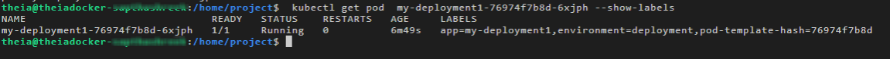
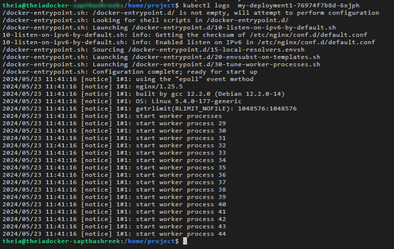
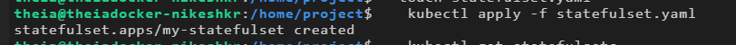

# Lab-2: Practice to Objects

## Practice Lab: Introduction to Kubernetes Objects

### Lab Overview

**Estimated time needed: 45 minutes**

This practice lab provides hands-on experience with Kubernetes, focusing on creating services, using various `kubectl` commands, and deploying StatefulSets and DaemonSets.

### Objectives

After completing this lab, you will be able to:

* Create a Kubernetes Service
* Use various `kubectl` commands
* Deploy a StatefulSet for managing stateful applications
* Implement a DaemonSet for running a single pod on all nodes


Kindly complete the lab in a single session without any break because the lab may go on offline mode and may cause errors. If you face any issues or errors during the lab process, please log out of the lab environment. Then clear your system cache and cookies and try to complete the lab.


***

## Setup Environment

Open a terminal window using the menu:

```
Terminal > New Terminal
```


If the terminal is already opened, please skip this step.





### Verify kubectl Version

Before proceeding, ensure that you have kubectl installed and properly configured.

To check the version of kubectl, run:

```bash
kubectl version
```

You should see the following output, although the versions may be different:





## Task 1: Create a Kubernetes Service Using nginx Image

A popular open-source web server, **nginx** is known for its high performance, stability, and low resource usage.

It can also function as a:

* Reverse proxy
* Load balancer
* HTTP cache

Creating a Kubernetes Service using an nginx image involves setting up a networking layer that allows other components within the Kubernetes cluster or external users to access the nginx application running in Pods.

To run nginx as a Service in Kubernetes, follow these steps.



### Create a Deployment named `my-deployment1` using the nginx image

```bash
kubectl create deployment my-deployment1 --image=nginx
```


#### Command Explanation

* `kubectl`: The command-line tool for interacting with the Kubernetes API.
* `create deployment`: Tells Kubernetes that you want to create a new Deployment.
* `my-deployment1`: It is the name of the Deployment being created. In this case, the Deployment is named `my-deployment1`.
* `--image=nginx`: It specifies the container image used for the Pods managed by this Deployment. The nginx image is a popular web server and reverse proxy server.

The command creates a Deployment named `my-deployment1` that uses the nginx image.

Deployments manage the rollout and scaling of applications.



### Expose the Deployment as a Service

```bash
kubectl expose deployment my-deployment1 --port=80 --type=NodePort --name=my-service1
```


This exposes the `my-deployment1` Deployment as a Service named `my-service1`, making it accessible on port `80` through a NodePort.

NodePort Services allow external traffic to access the Service.



### List All Services in the Default Namespace

```bash
kubectl get services
```


This command lists all the Services in the default namespace, including `nginx-service`, and provides details such as:

* ClusterIP
* NodePort
* Target port

By following these steps, you create a Kubernetes Service named `nginx`, which routes traffic to the nginx Pods running in your cluster, making them accessible internally and externally via the assigned NodePort.



## Task 2: Manage Kubernetes Pods and Services



### Get the List of Pods

```bash
kubectl get pods
```


This command displays all Pods, including those created by the `my-deployment1` Deployment.



### Show Labels

Replace `<pod-name>` with the actual Pod name:

```bash
kubectl get pod <pod-name> --show-labels
```


This command lists the labels associated with the specified Pod, helping you identify its attributes and categorization within your Kubernetes cluster.



### Label the Pod

Replace `<pod-name>` with the actual Pod name:

```bash
kubectl label pods <pod-name> environment=deployment
```


The command labels a specific Pod with the key-value pair `environment=deployment`.

This label helps categorize and manage Pods based on their deployment environment, making it easier to organize and select Kubernetes objects within the cluster.



### Show Labels Again

Replace `<pod-name>` with the actual Pod name:

```bash
kubectl get pod <pod-name> --show-labels
```





### Run a Test Pod Using the `nginx` Image

```bash
kubectl run my-test-pod --image=nginx --restart=Never
```


This command tells Kubernetes to create a Pod named `my-test-pod` using the nginx image, and the Pod will not restart automatically if it stops for any reason because `--restart=Never` is being used.



### Show Logs

Replace `<pod-name>` with the actual name of the Pod:

```bash
kubectl logs <pod-name>
```



This command retrieves and displays the logs generated by the specified Pod, allowing you to:

* Troubleshoot issues
* Monitor activity
* Gather information about the Pod's behavior



## Task 3: Deploying a StatefulSet

A StatefulSet manages the deployment and scaling of a set of Pods, and maintains a sticky identity for each of their Pods, ensuring that each Pod has a persistent identity and storage.



### Create and Open `statefulset.yaml`

Create and open a file named `statefulset.yaml` in edit mode:

```bash
touch statefulset.yaml
```





### Add the StatefulSet Configuration

Open `statefulset.yaml`, add the following code, and save the file:

```yaml
apiVersion: apps/v1
kind: StatefulSet
metadata:
  name: my-statefulset
spec:
  serviceName: "nginx"
  replicas: 3
  selector:
    matchLabels:
      app: nginx
  template:
    metadata:
      labels:
        app: nginx
    spec:
      containers:
        - name: nginx
          image: nginx
          ports:
            - containerPort: 80
              name: web
  volumeClaimTemplates:
    - metadata:
        name: www
      spec:
        accessModes: [ "ReadWriteOnce" ]
        resources:
          requests:
            storage: 1Gi
```

#### Explanation

* `apiVersion: apps/v1` & `kind: StatefulSet`: Establishes that this resource is a StatefulSet, leveraging the stable, production-ready apps/v1 API.
* `metadata.name: my-statefulset`: Assigns a human-readable identifier to the StatefulSet.
* `spec.serviceName: "nginx"`: Binds the StatefulSet to a headless Service named “nginx,” ensuring each Pod has a stable network identity.
* `spec.replicas: 3`: Orchestrates three Pod replicas, each with its own persistent identity.
* `spec.selector.matchLabels`: Directs the StatefulSet to manage Pods labeled `app: nginx`.
* `spec.template`: Defines the Pod blueprint.
* `metadata.labels`: `app: nginx` ensures new Pods carry the matching label.
* `spec.containers`: Configures the `nginx` container on port `80`, named `web`.
* `volumeClaimTemplates`: Automates the creation of a PersistentVolumeClaim named `www` for each replica, each requesting `1 Gi` of storage with `ReadWriteOnce` access.



### Apply the StatefulSet Configuration

```bash
kubectl apply -f statefulset.yaml
```



This command tells Kubernetes to create the resources defined in the YAML file.



### Verify that the StatefulSet Is Created

```bash
kubectl get statefulsets
```


After applying the StatefulSet, verify that the StatefulSet has been created and is running.

This can be done using the `kubectl get` command.

By following these steps, you can successfully apply a StatefulSet in Kubernetes.

The `kubectl apply` command is used to create the StatefulSet, and the `kubectl get` command helps you verify that the StatefulSet is running as expected.



## Task 4: Implementing a DaemonSet

A DaemonSet ensures that a copy of a specific Pod runs on all (or some) nodes in the cluster.

It is particularly useful for deploying system-level applications that provide essential services across the nodes in a cluster, such as:

* Log collection
* Monitoring
* Networking services



### Create `daemonset.yaml`

Create a file named `daemonset.yaml` and open it in edit mode:

```bash
touch daemonset.yaml
```





### Add the DaemonSet Configuration

Create and open a file named `daemonset.yaml` in edit mode and add:

```yaml
apiVersion: apps/v1
kind: DaemonSet
metadata:
  name: my-daemonset
spec:
  selector:
    matchLabels:
      name: my-daemonset
  template:
    metadata:
      labels:
        name: my-daemonset
    spec:
      containers:
        - name: my-daemonset
          image: nginx
```

#### Explanation

* `apiVersion: apps/v1` & `kind: DaemonSet`: Declares this resource as a DaemonSet under the stable apps/v1 API.
* `metadata.name: my-daemonset`: Provides the DaemonSet’s unique name.
* `spec.selector.matchLabels`: Targets Pods labeled `name: my-daemonset` for scheduling.
* `spec.template.metadata.labels`: Labels the Pod template so it matches the selector.
* `spec.template.spec.containers`: Defines a single container named `my-daemonset` using the nginx image.



### Apply the DaemonSet

```bash
kubectl apply -f daemonset.yaml
```


This command tells Kubernetes to apply the configuration defined in the `daemonset.yaml` file.

The `apply` command is used to create or update Kubernetes resources based on the configuration provided in the YAML file.



### Verify the DaemonSet

```bash
kubectl get daemonsets
```


This output from `kubectl get daemonsets` provides information about the DaemonSet named `my-daemonset` in your Kubernetes cluster.

#### DaemonSet Output Fields

| Field           | Description / value stated in the lab                                               |
| --------------- | ----------------------------------------------------------------------------------- |
| `NAME`          | Name of the DaemonSet, `my-daemonset` in this case                                  |
| `DESIRED`       | Desired number of DaemonSet Pods; the example shows `7`                             |
| `CURRENT`       | Current number of DaemonSet Pods running; the example shows `6`                     |
| `READY`         | Number of DaemonSet Pods that are ready and available; all 6 running Pods are ready |
| `UP-TO-DATE`    | Number of DaemonSet Pods that are up-to-date with the latest configuration          |
| `AVAILABLE`     | Number of DaemonSet Pods available for use                                          |
| `NODE SELECTOR` | Specifies which nodes in the cluster the DaemonSet should run on                    |
| `AGE`           | The age of the DaemonSet, indicating how long it has been running                   |

The `NODE SELECTOR` is set to:

```
<none>
```

This means the DaemonSet is not restricted to specific nodes.



## Command Reference

| Command                                                                                 | Purpose                                                              |
| --------------------------------------------------------------------------------------- | -------------------------------------------------------------------- |
| `kubectl version`                                                                       | Verify the kubectl installation/version                              |
| `kubectl create deployment my-deployment1 --image=nginx`                                | Create an nginx Deployment named `my-deployment1`                    |
| `kubectl expose deployment my-deployment1 --port=80 --type=NodePort --name=my-service1` | Expose the Deployment through a NodePort Service named `my-service1` |
| `kubectl get services`                                                                  | List Services in the default namespace                               |
| `kubectl get pods`                                                                      | List Pods                                                            |
| `kubectl get pod <pod-name> --show-labels`                                              | Show labels for a Pod                                                |
| `kubectl label pods <pod-name> environment=deployment`                                  | Add the `environment=deployment` label to a Pod                      |
| `kubectl run my-test-pod --image=nginx --restart=Never`                                 | Run a standalone nginx Pod without automatic restart                 |
| `kubectl logs <pod-name>`                                                               | Display Pod logs                                                     |
| `touch statefulset.yaml`                                                                | Create the StatefulSet YAML file                                     |
| `kubectl apply -f statefulset.yaml`                                                     | Create/apply the StatefulSet from the YAML file                      |
| `kubectl get statefulsets`                                                              | Verify the StatefulSet                                               |
| `touch daemonset.yaml`                                                                  | Create the DaemonSet YAML file                                       |
| `kubectl apply -f daemonset.yaml`                                                       | Create/apply the DaemonSet from the YAML file                        |
| `kubectl get daemonsets`                                                                | Verify the DaemonSet                                                 |

## Kubernetes Object Relationships Demonstrated

```
Deployment
    ↓
Replicated Pods
    ↓
Service / NodePort
    ↓
Application access
```

```
StatefulSet
    ↓
3 Pod replicas
    ↓
Persistent identity
    ↓
PersistentVolumeClaims
    ↓
1Gi storage request per replica
```

```
DaemonSet
    ↓
Pod copy on eligible nodes
    ↓
System-level workload
    ├── Logs
    ├── Monitoring
    └── Networking
```

## Task Checklist

### Task 1 — Service

```
[ ] Verify kubectl
[ ] Create my-deployment1 with nginx
[ ] Expose as my-service1
[ ] Use port 80
[ ] Use NodePort
[ ] List Services
```

### Task 2 — Pods and Services

```
[ ] List Pods
[ ] Show Pod labels
[ ] Add environment=deployment
[ ] Verify labels
[ ] Create my-test-pod
[ ] Use nginx image
[ ] Use --restart=Never
[ ] View logs
```

### Task 3 — StatefulSet

```
[ ] Create statefulset.yaml
[ ] Add StatefulSet YAML
[ ] Set replicas to 3
[ ] Use nginx image
[ ] Configure port 80
[ ] Configure volumeClaimTemplates
[ ] Request 1Gi storage
[ ] Apply the StatefulSet
[ ] Verify the StatefulSet
```

### Task 4 — DaemonSet

```
[ ] Create daemonset.yaml
[ ] Add DaemonSet YAML
[ ] Use nginx image
[ ] Apply the DaemonSet
[ ] Verify the DaemonSet
[ ] Review DESIRED
[ ] Review CURRENT
[ ] Review READY
[ ] Review NODE SELECTOR
```

## Lab Conclusion

Congratulations! You have completed the practice lab on Kubernetes.

You created:

* A Kubernetes Service.
* Various `kubectl` commands were used.
* StatefulSets for stateful applications.
* DaemonSets for uniform Pod deployment across cluster nodes.

***

**Author:** [Manvi Gupta](https://www.linkedin.com/in/manvi-gupta-764438262/)

© IBM Corporation. All rights reserved.
