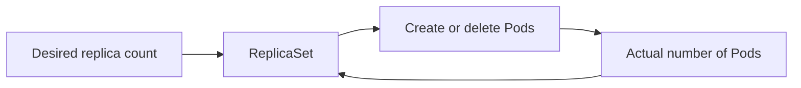

# ReplicaSet with Examples

## Overview

This document preserves the complete ReplicaSet lesson content from the supplied TXT and VTT sources, then adds clearly labeled practical examples for every command described by the lesson. It covers why ReplicaSets are needed, desired-state reconciliation, scaling, Pod replacement, the relationship between ReplicaSets and Deployments, label-based Pod selection, and creating or managing ReplicaSets. The supplied Coursera lecture URL could not be opened at the lecture level during verification, so the lesson body is grounded in the uploaded TXT/VTT; the Coursera page is used only for context.


**Source access:** The supplied Coursera lecture URL returned a 404 in the browser tool. The attached TXT and VTT were therefore treated as the authoritative lesson sources.


## Learning Objectives

After watching the video, the learner will be able to:

1. Define a ReplicaSet.
2. Explain how a ReplicaSet works.
3. List the benefits of using a ReplicaSet.

## Why a Single Pod Is Not Enough

The lesson starts with a single-Pod deployment and describes several limitations.

If an application is deployed on a single Pod, the Pod can be unable to handle certain situations:

* Requests can increase manifold.
* Outages can occur.
* A single-Pod deployment cannot accommodate growing application demands.
* A single-Pod deployment cannot provide load balancing across Pods.
* A single Pod creates a single point of failure.
* Outages can result in downtime and service interruptions.

The lesson identifies the desired operational goals as:

* Handling outages by eliminating a single point of failure.
* Minimizing downtime and service interruptions.
* Providing high availability through redundant Pods.
* Automatically restarting deployments if something goes wrong.

## What a ReplicaSet Does

The lesson says these limitations can be addressed with a ReplicaSet.

A ReplicaSet ensures that the right number of Pods are always up and running. It continuously tries to match the actual state of the replicas to the desired state.

A ReplicaSet:

* Adds Pods for scaling and redundancy.
* Deletes Pods when needed to maintain the desired state.
* Helps maintain availability.
* Replaces failing Pods.
* Deletes additional Pods when there are more Pods than desired.

### Desired-State Model



_Caption: The lesson's central control loop is that the ReplicaSet continually works to bring the actual replica count back to the desired state._

### 💡 Real-World Use Case (added)

A checkout service in production is configured for three replicas. One Pod crashes while traffic is still arriving. The ReplicaSet notices that only two matching Pods remain and creates a replacement so the application returns to the desired replica count.

## Desired State and Actual State

The lesson repeatedly uses the distinction between **desired state** and **actual state**.

* **Desired state:** the number of replicas the system is supposed to maintain.
* **Actual state:** the Pods that are currently present and running.

The ReplicaSet keeps comparing these states and acts when they do not match.

When the actual state has fewer Pods than desired, it creates Pods. When the actual state has more Pods than desired, it deletes extra Pods.

### 💡 Real-World Use Case (added)

A team wants exactly five API Pods during a business peak. If a node failure leaves only four matching Pods, reconciliation creates another Pod. If someone accidentally creates a sixth matching Pod, the ReplicaSet removes the excess Pod.

## Scaling and Redundancy

A ReplicaSet uses creation and deletion of Pods for scaling and redundancy. This helps maintain application availability.

The lesson's scaling model is:

```
Desired replicas = 3
        |
        v
ReplicaSet
   |    |    |
  Pod  Pod  Pod
```

If the desired count changes, the ReplicaSet creates or deletes Pods to reach that count.

## ReplicaSet and ReplicationController

The lesson states that a ReplicaSet supersedes a `ReplicaController` and should be used instead.


**Unclear in source:** The transcript says “ReplicaController.” Current Kubernetes terminology uses **ReplicationController**. This document preserves the lesson's wording in the source section and does not silently rewrite it.


## ReplicaSet and Deployment Relationship

A ReplicaSet is created when you create a Deployment in the cluster.

The lesson states that:

* Deployments manage ReplicaSets.
* Deployments send Pods declarative updates.
* Deployments provide many other useful features.
* A ReplicaSet is therefore best managed by a Deployment.

The lesson explicitly recommends creating a Deployment that includes a ReplicaSet rather than creating a standalone ReplicaSet directly.

### Relationship

```
Deployment
    |
    v
ReplicaSet
    |
    v
Pods
```

_Caption: The lesson describes the Deployment as the higher-level object that manages the ReplicaSet._

### 💡 Real-World Example (added)

**Scenario:** A backend team deploys an API and wants Kubernetes to manage the replica count and rollout behavior through a Deployment rather than manually managing a standalone ReplicaSet.

**Command:**

```bash
kubectl create deployment payments-api --image=nginx --replicas=3
```

**Typical output (illustrative):**

```
Deployment "payments-api" created
```

**Explanation:**

* `kubectl create deployment` creates a Deployment.
* `payments-api` is the Deployment name.
* `--image=nginx` supplies the container image for the Pod template.
* `--replicas=3` requests three replicas.
* Current Kubernetes documentation supports this syntax and the `--replicas` option. citeturn491484search1

**Variation / common mistake:** If `--replicas` is omitted, current `kubectl create deployment` defaults the replica count to `1`. citeturn491484search1

## How a ReplicaSet Selects Pods

Kubernetes is designed to keep object types independent. The lesson therefore says the ReplicaSet does not own Pods directly in the sense described in the lecture. Instead, it uses Pod labels to decide which Pods to acquire when bringing a Deployment to the desired state.

The key mechanism is the Pod's **label**.

### 💡 Real-World Example (added)

**Scenario:** A platform team needs to inspect the Pods selected for the `payments-api` Deployment.

**Command:**

```bash
kubectl get pods -l app=payments-api
```

**Typical output (illustrative):**

```
NAME                            READY   STATUS    RESTARTS   AGE
payments-api-6d7f9c8d6b-abc12   1/1     Running   0          3m
payments-api-6d7f9c8d6b-def34   1/1     Running   0          3m
payments-api-6d7f9c8d6b-ghi56   1/1     Running   0          3m
```

**Explanation:**

* `kubectl get pods` lists Pods.
* `-l app=payments-api` filters the Pods by the label selector `app=payments-api`.
* This practical selector behavior is consistent with the lesson's statement that Pod labels are used to identify the Pods a ReplicaSet should acquire. The official ReplicaSet documentation likewise describes selectors as the mechanism for acquiring matching Pods. citeturn685512search1turn491484search5

**Variation / common mistake:** A label mismatch can cause the selector not to match the intended Pods. Check the labels with `kubectl get pods --show-labels` when debugging selection issues.

## Deployment Template and Labels

The lesson says a Deployment template contains metadata that defines:

* Labels.
* A Pod `spec` describing potential Pod candidates to add or delete.

The ReplicaSet uses this template information when it works toward the Deployment's desired state.

## ReplicaSet Automatically Created by a Deployment

The lesson explains that a ReplicaSet is automatically created when a Deployment is created.

The suggested verification flow is:



## Create a Deployment



## Use a `get ReplicaSet` command

Verify that the ReplicaSet was generated automatically.



## Describe the Pod

Inspect its details to see that it is controlled by the same ReplicaSet.



### 💡 Real-World Example (added) — View the ReplicaSet

**Scenario:** After deploying `payments-api`, you want to verify which ReplicaSet the Deployment created.

**Command:**

```bash
kubectl get rs
```

**Typical output (illustrative):**

```
NAME                     DESIRED   CURRENT   READY   AGE
payments-api-6d7f9c8d6b  3         3         3       2m
```

**Explanation:**

* `kubectl get` lists resources.
* `rs` is the short resource name for ReplicaSet.
* `DESIRED` is the target replica count.
* `CURRENT` is the number currently running.
* `READY` is the number available/ready.
* The current Kubernetes Deployment documentation demonstrates `kubectl get rs` for inspecting the ReplicaSet created by a Deployment. citeturn685512search3

**Variation / common mistake:** `kubectl get replicasets` is a more explicit resource name if someone is unfamiliar with the `rs` shorthand.

### 💡 Real-World Example (added) — Describe a Pod

**Scenario:** One Pod is behaving unexpectedly and you need to inspect its controller, events, and other details.

**Command:**

```bash
kubectl describe pod payments-api-6d7f9c8d6b-abc12
```

**Typical output (illustrative):**

```
Name:         payments-api-6d7f9c8d6b-abc12
Namespace:    default
Status:       Running
Controlled By: ReplicaSet/payments-api-6d7f9c8d6b
Events:
  Type     Reason     Message
  Normal   Scheduled  Successfully assigned ...
```

**Explanation:**

* `kubectl describe pod` requests a detailed Pod description.
* The Pod name identifies the resource.
* The output can include related resources and controller information.
* Current `kubectl describe` documentation supports `kubectl describe pods/<name>` / `kubectl describe pod <name>`. citeturn491484search3

**Variation / common mistake:** If the Pod is in another namespace, specify `-n <namespace>`; otherwise `kubectl` uses the namespace from the current context.

## Default Replica Count in the Lesson

The lesson says that, by default, the ReplicaSet replicates to a single Pod. It also states that if you define the number of replicas as `1`, you get one Pod. This is described as similar to creating the default without specifying the number of replicas in the YAML file.


The statements above are preserved from the lesson. The exact YAML shown in the video is not present in the supplied transcript.


## ReplicaSet Created from Scratch

The lesson says that a ReplicaSet can be created from scratch by applying a YAML file with the `kind` attribute set to `ReplicaSet`.


**Unclear in source:** The exact YAML content is not included in the supplied transcript, only the instruction that the YAML should use `kind: ReplicaSet`.


### 💡 Real-World Example (added)

**Scenario:** A platform team wants a standalone ReplicaSet in a sandbox to understand how replica reconciliation works.

**Command:**

```bash
kubectl apply -f checkout-replicaset.yaml
```

**Typical output (illustrative):**

```
replicaset.apps/checkout-api created
```

**Explanation:**

* `kubectl apply -f` applies a resource definition from a file.
* `checkout-replicaset.yaml` is the manifest file.
* The manifest should declare `kind: ReplicaSet` and a matching selector/template in a real implementation.

**Variation / common mistake:** A selector/template label mismatch can prevent the API from accepting the ReplicaSet or cause it to manage unexpected Pods. The official ReplicaSet documentation requires the template labels to match the selector. citeturn685512search1

### 💡 Real-World Example (added) — Create from YAML with `kubectl create`

**Scenario:** A test environment requires a one-time creation from a ReplicaSet manifest and the team wants the create operation rather than an apply workflow.

**Command:**

```bash
kubectl create -f checkout-replicaset.yaml
```

**Typical output (illustrative):**

```
replicaset.apps/checkout-api created
```

**Explanation:**

* `kubectl create -f` creates a resource from a YAML or JSON file.
* `checkout-replicaset.yaml` contains the ReplicaSet definition.
* Current `kubectl create` documentation supports file-based resource creation. citeturn491484search6

**Variation / common mistake:** Running `kubectl create -f` again for an existing object normally fails because the object already exists; use an update/apply workflow when the intent is to reconcile an existing object.

## Step-by-Step Standalone ReplicaSet Workflow

The lesson then walks through creating a ReplicaSet from scratch:



## Use the create ReplicaSet command



## Confirm it was created

Use the `get pods` command and observe that the Pod is `Running`.



## Inspect the ReplicaSet

Use the `get rs` command (`rs` is short for ReplicaSet). Inspect the ReplicaSet name and other details for the ReplicaSet and its Pod.



### 💡 Real-World Example (added) — Check the Pods

**Scenario:** After creating a sandbox ReplicaSet, you want to confirm its Pods are actually running.

**Command:**

```bash
kubectl get pods
```

**Typical output (illustrative):**

```
NAME                  READY   STATUS    RESTARTS   AGE
checkout-api-rs-x7k2  1/1     Running   0          45s
```

**Explanation:**

* `kubectl get pods` lists Pods in the current namespace.
* `READY 1/1` indicates one container is ready out of one.
* `STATUS Running` indicates the Pod is currently running.
* Current `kubectl get` documentation supports listing Pods with `kubectl get pods`. citeturn491484search5

**Variation / common mistake:** If no Pods appear, check the namespace/context before assuming the ReplicaSet did not create them.

### 💡 Real-World Example (added) — Inspect the ReplicaSet

**Scenario:** You confirmed the Pod exists and now want to see the ReplicaSet's desired/current/ready counts.

**Command:**

```bash
kubectl get rs
```

**Typical output (illustrative):**

```
NAME            DESIRED   CURRENT   READY   AGE
checkout-api    1         1         1       1m
```

**Explanation:**

* `rs` requests ReplicaSet resources.
* `DESIRED` is the target count.
* `CURRENT` is the current count.
* `READY` shows ready replicas.
* `rs` is the shorthand used in the lesson and in current Kubernetes documentation. citeturn491484search0turn685512search3

**Variation / common mistake:** If the ReplicaSet is in another namespace, add `-n <namespace>`.

## Deployment and Scaling Workflow

The lesson recommends using a Deployment rather than a standalone ReplicaSet, then demonstrates scaling the Deployment.

Before scaling a Deployment, the lesson says to ensure that a Deployment and a Pod exist.



## Create a Deployment using the create command

Confirm that the Deployment was created.



## Confirm the initial Pod

The Deployment creates a Pod by default. Confirm the Pod with `get pods`.



## Check Deployment details

Use `get deploy`. The Deployment is named `hello-kubernetes`.



## Scale the Deployment

Use the scale command to set the desired number of replicas to three.



## Verify the Pods

Use `get pods` and observe three running Pods. The ReplicaSet creates two new Pods to reach the desired total of three.



### 💡 Real-World Example (added) — Create the Deployment

**Scenario:** A development team is deploying a simple internal service and wants Kubernetes to create its first Pod plus the ReplicaSet managed by a Deployment.

**Command:**

```bash
kubectl create deployment hello-kubernetes --image=nginx
```

**Typical output (illustrative):**

```
deployment.apps/hello-kubernetes created
```

**Explanation:**

* `kubectl create deployment` creates the Deployment.
* `hello-kubernetes` is the Deployment name used by the lesson.
* `--image=nginx` defines the container image for the Pod template.
* Current Kubernetes documentation shows this syntax for creating a Deployment and notes that the default replica count is 1. citeturn491484search1

**Variation / common mistake:** In a real environment, pin an image tag instead of relying on an implicit image version when reproducibility matters, for example `nginx:1.27`.

### 💡 Real-World Example (added) — Verify the Pod

**Scenario:** After creating `hello-kubernetes`, confirm that its initial Pod exists.

**Command:**

```bash
kubectl get pods
```

**Typical output (illustrative):**

```
NAME                               READY   STATUS    RESTARTS   AGE
hello-kubernetes-6b79f9c8d7-j7m2p  1/1     Running   0          30s
```

**Explanation:**

* The Deployment creates its initial Pod.
* The generated Pod name contains the Deployment/ReplicaSet naming lineage.
* `kubectl get pods` confirms the Pod is present and running.

**Variation / common mistake:** If the Pod is `Pending` rather than `Running`, inspect it with `kubectl describe pod <pod-name>` before assuming creation failed.

### 💡 Real-World Example (added) — Get Deployment Details

**Scenario:** You need to confirm the Deployment name and its current replica state before scaling it.

**Command:**

```bash
kubectl get deploy hello-kubernetes
```

**Typical output (illustrative):**

```
NAME              READY   UP-TO-DATE   AVAILABLE   AGE
hello-kubernetes  1/1     1            1           1m
```

**Explanation:**

* `get deploy` uses `deploy` as the resource shorthand.
* `hello-kubernetes` identifies the Deployment.
* The output exposes readiness and availability counts useful before scaling.

**Variation / common mistake:** `kubectl get deployment hello-kubernetes` is the long-form resource spelling if the shorthand is unfamiliar.

### 💡 Real-World Example (added) — Scale to Three Replicas

**Scenario:** Traffic to `hello-kubernetes` is increasing, so the team wants three Pods instead of one.

**Command:**

```bash
kubectl scale deployment/hello-kubernetes --replicas=3
```

**Typical output (illustrative):**

```
deployment.apps/hello-kubernetes scaled
```

**Explanation:**

* `kubectl scale` changes the requested replica count.
* `deployment/hello-kubernetes` identifies the target Deployment.
* `--replicas=3` sets the desired replica count to three.
* Current Kubernetes documentation supports this exact command form. citeturn491484search0turn685512search2

**Variation / common mistake:** Scaling changes the desired count immediately, but Pod startup takes time; verify the actual result with `kubectl get pods` or `kubectl get deployment hello-kubernetes`.

### 💡 Real-World Example (added) — Verify Three Pods

**Scenario:** After scaling the Deployment, verify that all three replicas are running.

**Command:**

```bash
kubectl get pods
```

**Typical output (illustrative):**

```
NAME                               READY   STATUS    RESTARTS   AGE
hello-kubernetes-6b79f9c8d7-j7m2p  1/1     Running   0          2m
hello-kubernetes-6b79f9c8d7-k9x4q  1/1     Running   0          10s
hello-kubernetes-6b79f9c8d7-r8m1s  1/1     Running   0          10s
```

**Explanation:**

* The first Pod was already running.
* Two additional Pods were created when the desired count changed from one to three.
* The exact generated Pod names vary.

**Variation / common mistake:** If only two Pods are ready, allow time for scheduling/startup and inspect the non-ready Pod with `kubectl describe pod <pod-name>`.

## Maintaining Desired State When a Pod Is Deleted

The lesson then demonstrates reconciliation after an existing Pod is deleted.



## Check the Pods

Use `get pods` and observe the three Pods.



## Delete a Pod

Use a `delete pod` command to delete the Pod ending in `5mflw`.



## Observe reconciliation

The Pod is deleted, desired state no longer matches actual state, and the deleted Pod is automatically replaced.



## Verify the replacement

Use `get pods` again. The lesson observes a new Pod ending in `6lw4r`, restoring the total to three.



### 💡 Real-World Example (added) — Delete One Pod Safely in a Sandbox

**Scenario:** In a non-production test namespace, you want to demonstrate ReplicaSet reconciliation by deleting one Pod from a Deployment-managed workload.


`kubectl delete pod` is destructive. The example is intentionally scoped to a sandbox/test workload. In a production incident, confirm the target Pod and workload before deleting anything.


**Command:**

```bash
kubectl delete pod hello-kubernetes-6b79f9c8d7-j7m2p
```

**Typical output (illustrative):**

```
pod "hello-kubernetes-6b79f9c8d7-j7m2p" deleted
```

**Explanation:**

* `kubectl delete pod` deletes the named Pod.
* The Deployment/ReplicaSet relationship described by the lesson causes a replacement Pod to be created so the desired replica count returns to three.
* Current Kubernetes documentation supports `kubectl delete pod <name>` and documents graceful Pod deletion. citeturn491484search2

**Variation / common mistake:** Do not use `--force` casually. Current Kubernetes documentation warns that force-deleting Pods can create consistency or duplicate-process risks. citeturn491484search2

### 💡 Real-World Example (added) — Verify the Replacement

**Scenario:** After deleting one Pod, confirm that Kubernetes created a replacement and that three replicas are present again.

**Command:**

```bash
kubectl get pods
```

**Typical output (illustrative):**

```
NAME                               READY   STATUS    RESTARTS   AGE
hello-kubernetes-6b79f9c8d7-k9x4q  1/1     Running   0          2m
hello-kubernetes-6b79f9c8d7-r8m1s  1/1     Running   0          2m
hello-kubernetes-6b79f9c8d7-v3n6t  1/1     Running   0          15s
```

**Explanation:**

* The deleted Pod name disappeared.
* A new Pod appeared.
* The desired total returns to three.

**Variation / common mistake:** If the replacement Pod is `Pending`, inspect scheduling/container events with `kubectl describe pod <new-pod-name>`.

## Maintaining Desired State When an Extra Pod Is Created

The lesson demonstrates the opposite mismatch: too many Pods.



## Inspect the existing Pods

`get pods` shows the existing three Pods.



## Create an additional Pod

A `create pod` command creates an additional Pod ending in `mx9rp`.



## Observe the mismatch

`get pods` then shows four Pods, so desired state does not match actual state.



## Observe reconciliation

The ReplicaSet notices the mismatch. The new extra Pod is marked for deletion and removed automatically, restoring the total to three.



### 💡 Real-World Example (added) — Create an Extra Pod

**Scenario:** In a sandbox namespace, a developer manually starts an extra Pod using the same application label as a ReplicaSet-managed workload. This demonstrates why label selection matters.

**Command:**

```bash
kubectl run checkout-manual-pod --image=nginx
```

**Typical output (illustrative):**

```
pod/checkout-manual-pod created
```

**Explanation:**

* `kubectl run` creates and runs a Pod from the specified image.
* `checkout-manual-pod` is the Pod name.
* `--image=nginx` sets the container image.
* Current Kubernetes documentation supports `kubectl run NAME --image=image`. citeturn491484search4
* **Important source distinction:** the lesson does not provide the exact syntax for its “create pod command,” so this is an added practical example rather than a transcription of the lesson command.

**Variation / common mistake:** The source's over-capacity example depends on how the Pod matches the ReplicaSet's selector. A manually created Pod does not automatically become managed by a particular ReplicaSet just because it is a Pod; label selector behavior matters. The official ReplicaSet documentation explains that matching Pods can be acquired. citeturn685512search1

### 💡 Real-World Example (added) — Check the Four-Pod State

**Scenario:** Immediately after an extra Pod is created, you want to observe the temporary mismatch between desired and actual Pod counts.

**Command:**

```bash
kubectl get pods
```

**Typical output (illustrative):**

```
NAME                               READY   STATUS    RESTARTS   AGE
hello-kubernetes-6b79f9c8d7-k9x4q  1/1     Running   0          4m
hello-kubernetes-6b79f9c8d7-r8m1s  1/1     Running   0          4m
hello-kubernetes-6b79f9c8d7-v3n6t  1/1     Running   0          2m
checkout-manual-pod                1/1     Running   0          5s
```

**Explanation:**

* `kubectl get pods` provides the visible Pod count.
* The temporary fourth Pod illustrates the lesson's extra-Pod scenario.
* ReplicaSet reconciliation may remove an extra matching Pod to restore the target state, depending on label selection.

**Variation / common mistake:** If the extra Pod has labels that do not match the ReplicaSet selector, it may remain because the ReplicaSet has no reason to acquire it. This selector behavior is documented by Kubernetes. citeturn685512search1

## CLI vs. YAML

The lesson concludes that a ReplicaSet can be created using either:

* The CLI.
* A YAML descriptor.

The transcript specifically mentions applying a YAML file where the `kind` attribute is set to `ReplicaSet`, but it does not include the exact YAML shown in the video.


**Unclear in source:** The complete ReplicaSet YAML manifest is not present in the supplied TXT/VTT. Only the `kind: ReplicaSet` detail is explicitly described.


## Benefits of Using a ReplicaSet

The lesson identifies these benefits:

* High availability through redundancy.
* Scaling by creating or deleting Pods.
* Matching actual state to desired state.
* Replacing failing Pods.
* Removing extra Pods.
* Maintaining application availability.

The lesson's best-practice conclusion is to use a Deployment instead of a ReplicaSet directly.

## Command Reference

### Resource Inspection

| Command                       | Purpose                                              | Syntax / Example                      | Notes                                                          |
| ----------------------------- | ---------------------------------------------------- | ------------------------------------- | -------------------------------------------------------------- |
| `kubectl get pods`            | Inspect Pods                                         | `kubectl get pods`                    | Used repeatedly in the lesson to verify Pod counts and status. |
| `kubectl get rs`              | Inspect ReplicaSets                                  | `kubectl get rs`                      | `rs` is the short resource name for ReplicaSet.                |
| `kubectl get deploy <name>`   | Inspect a Deployment                                 | `kubectl get deploy hello-kubernetes` | The lesson names `hello-kubernetes`.                           |
| `kubectl describe pod <name>` | Inspect Pod details and controller/event information | `kubectl describe pod <pod-name>`     | Exact output varies by cluster.                                |

### Resource Creation

| Command                     | Purpose                          | Syntax / Example                                           | Notes                                                                                   |
| --------------------------- | -------------------------------- | ---------------------------------------------------------- | --------------------------------------------------------------------------------------- |
| `kubectl create deployment` | Create a Deployment              | `kubectl create deployment hello-kubernetes --image=nginx` | Added practical syntax; current docs support it. citeturn491484search1               |
| `kubectl create -f <file>`  | Create a resource from YAML/JSON | `kubectl create -f checkout-replicaset.yaml`               | Added practical form verified against current kubectl docs. citeturn491484search6    |
| `kubectl run`               | Create/run a Pod from an image   | `kubectl run checkout-manual-pod --image=nginx`            | Added practical syntax; source only says “create pod command.” citeturn491484search4 |

### Scaling

| Command         | Purpose                      | Syntax / Example                                         | Notes                                                                                          |
| --------------- | ---------------------------- | -------------------------------------------------------- | ---------------------------------------------------------------------------------------------- |
| `kubectl scale` | Change desired replica count | `kubectl scale deployment/hello-kubernetes --replicas=3` | Current docs support Deployment/ReplicaSet scaling. citeturn491484search0turn685512search2 |

### Resource Deletion

| Command              | Purpose      | Syntax / Example                                       | Notes                                                                                         |
| -------------------- | ------------ | ------------------------------------------------------ | --------------------------------------------------------------------------------------------- |
| `kubectl delete pod` | Delete a Pod | `kubectl delete pod hello-kubernetes-6b79f9c8d7-j7m2p` | Destructive; use carefully. Current docs document graceful deletion. citeturn491484search2 |

## Key Terms / Glossary

### `ReplicaSet`

A Kubernetes controller described by the lesson as ensuring that the right number of Pods are always up and running and matching actual state to desired state.

### `Pod`

The workload instance managed by the ReplicaSet in the lesson; the lesson demonstrates Pods being created, deleted, and replaced.

### `Desired state`

The target number of replicas that the ReplicaSet is supposed to maintain.

### `Actual state`

The number/state of matching Pods currently present.

### `Redundancy`

Running multiple Pods so one failure does not create a single point of failure.

### `High availability`

The lesson's goal of minimizing downtime and service interruptions through redundant Pods.

### `Scaling`

Changing the number of Pods to match application demand.

### `Deployment`

The higher-level Kubernetes object that manages ReplicaSets and provides declarative updates and other features.

### `Pod label`

Metadata used by the ReplicaSet to decide which Pods to acquire.

### `ReplicaController`

The older controller referred to by the lesson as being superseded by ReplicaSet. The exact source wording is preserved.

### `YAML descriptor`

The configuration file format the lesson mentions for defining a ReplicaSet.

### `Controller`

The reconciliation component represented by the ReplicaSet that works toward the desired state.

## End-to-End Scenario (added)

A team is deploying `hello-kubernetes` and wants three replicas with automatic recovery. The scenario combines the lesson's Deployment → ReplicaSet → Pod model and the command patterns used in the lesson.



## Create the Deployment

**Scenario:** A team launches the service with one initial replica and lets the Deployment create the underlying ReplicaSet.

**Command:**

```bash
kubectl create deployment hello-kubernetes --image=nginx
```

**Typical output (illustrative):**

```
deployment.apps/hello-kubernetes created
```

**Explanation:** The Deployment is the higher-level resource. Current `kubectl create deployment` supports this command form and defaults to one replica when `--replicas` is omitted. citeturn491484search1

**Variation / common mistake:** If you want three replicas immediately, you can set `--replicas=3` at creation time rather than scaling afterward. citeturn491484search1



## Verify the ReplicaSet

**Scenario:** Confirm that the Deployment automatically produced a ReplicaSet.

**Command:**

```bash
kubectl get rs
```

**Typical output (illustrative):**

```
NAME                     DESIRED   CURRENT   READY   AGE
hello-kubernetes-6d7f9c  1         1         1       30s
```

**Explanation:** The `rs` resource shows the ReplicaSet created beneath the Deployment. Kubernetes documentation demonstrates the same `kubectl get rs` inspection pattern. citeturn685512search3

**Variation / common mistake:** If you see no ReplicaSet, check that you are in the same namespace as the Deployment.



## Scale the Deployment

**Scenario:** Traffic rises and the team needs three replicas.

**Command:**

```bash
kubectl scale deployment/hello-kubernetes --replicas=3
```

**Typical output (illustrative):**

```
deployment.apps/hello-kubernetes scaled
```

**Explanation:** The Deployment's desired replica count becomes three. The ReplicaSet then creates additional Pods until the actual state matches the desired state. Current docs support this syntax. citeturn491484search0turn685512search2

**Variation / common mistake:** Do not repeatedly run manual scaling if a HorizontalPodAutoscaler is managing the Deployment; current Kubernetes guidance warns that an HPA continuously reconciles replica count. citeturn685512search2



## Observe the Three Pods

**Scenario:** Verify that all three replicas now exist.

**Command:**

```bash
kubectl get pods
```

**Typical output (illustrative):**

```
NAME                               READY   STATUS    RESTARTS   AGE
hello-kubernetes-6d7f9c8d7-a1b2c  1/1     Running   0          1m
hello-kubernetes-6d7f9c8d7-d3e4f  1/1     Running   0          20s
hello-kubernetes-6d7f9c8d7-g5h6i  1/1     Running   0          20s
```

**Explanation:** The ReplicaSet is maintaining three Pods for the Deployment.

**Variation / common mistake:** Pod names and ages are generated values; do not hard-code them in automation unless the workflow intentionally derives them dynamically.



## Inspect One Pod

**Scenario:** One replica is slow to start and you want detailed events and controller information.

**Command:**

```bash
kubectl describe pod hello-kubernetes-6d7f9c8d7-a1b2c
```

**Typical output (illustrative):**

```
Name:             hello-kubernetes-6d7f9c8d7-a1b2c
Status:           Running
Controlled By:    ReplicaSet/hello-kubernetes-6d7f9c8d7-6d7f9c
Events:
  Type    Reason     Message
  Normal  Scheduled  Successfully assigned ...
```

**Explanation:** `describe` gives a detailed view and can include related controller information and events. citeturn491484search3

**Variation / common mistake:** Use the exact Pod name returned by `kubectl get pods`; generated suffixes change between runs.



## Delete One Pod and Observe Recovery

**Scenario:** In a sandbox, delete one replica to verify that the workload recovers automatically.


This command deletes a live Pod. Use a test/sandbox workload for this exercise.


**Command:**

```bash
kubectl delete pod hello-kubernetes-6d7f9c8d7-a1b2c
```

**Typical output (illustrative):**

```
pod "hello-kubernetes-6d7f9c8d7-a1b2c" deleted
```

**Explanation:** The Pod is deleted, the actual count temporarily drops below the desired count, and the ReplicaSet/Deployment reconciliation creates a replacement. citeturn491484search2turn685512search3

**Variation / common mistake:** Avoid `--force` unless you fully understand the implications; Kubernetes warns about possible duplicate processes and inconsistency when force-deleting Pods. citeturn491484search2



## Verify Recovery

**Scenario:** Confirm that the ReplicaSet returned the Deployment to three running replicas after the deletion.

**Command:**

```bash
kubectl get pods
```

**Typical output (illustrative):**

```
NAME                               READY   STATUS    RESTARTS   AGE
hello-kubernetes-6d7f9c8d7-d3e4f  1/1     Running   0          2m
hello-kubernetes-6d7f9c8d7-g5h6i  1/1     Running   0          2m
hello-kubernetes-6d7f9c8d7-j7m2p  1/1     Running   0          10s
```

**Explanation:** The replacement Pod is new, but the total returns to three. This is the central reconciliation behavior taught by the lesson.

**Variation / common mistake:** If the replacement stays `Pending`, use `kubectl describe pod <replacement-pod>` to inspect scheduling or image/container errors.



### TXT/VTT Reconciliation

* TXT line count: **73**.
* VTT cue count: **97**.
* Normalized transcript comparison: **exact match**.
* No transcript conflict was found between TXT and VTT.

### Source Ambiguities


**Unclear in source:** The lesson says “ReplicaController”; current Kubernetes terminology uses “ReplicationController.” This document preserves the lesson's wording and flags the discrepancy rather than silently changing it.



**Unclear in source:** The lesson names a “get ReplicaSet command,” “create ReplicaSet command,” “getpods command,” “get deploy command,” “scale command,” “delete pod command,” and “create pod command,” but does not show the full CLI syntax for all of them in the transcript. The practical examples in this document use current, verified `kubectl` syntax and are explicitly marked as added examples.



**Unclear in source:** The exact ReplicaSet YAML shown in the video is not included in the uploaded transcript. The lesson only states that the YAML uses `kind: ReplicaSet` and discusses replica count and labels/selectors conceptually.



The lesson says a ReplicaSet “does not own any of the pods” and describes label-based acquisition. The official Kubernetes documentation describes ReplicaSets as acquiring matching Pods through selectors. This document preserves the lesson's statement in the source-derived section and does not rewrite it. citeturn685512search1


### Added Example Verification

The practical command syntax added to this document was checked against current Kubernetes documentation for `kubectl create deployment`, `kubectl get`, `kubectl describe`, `kubectl run`, `kubectl scale`, and `kubectl delete`.&#x20;

