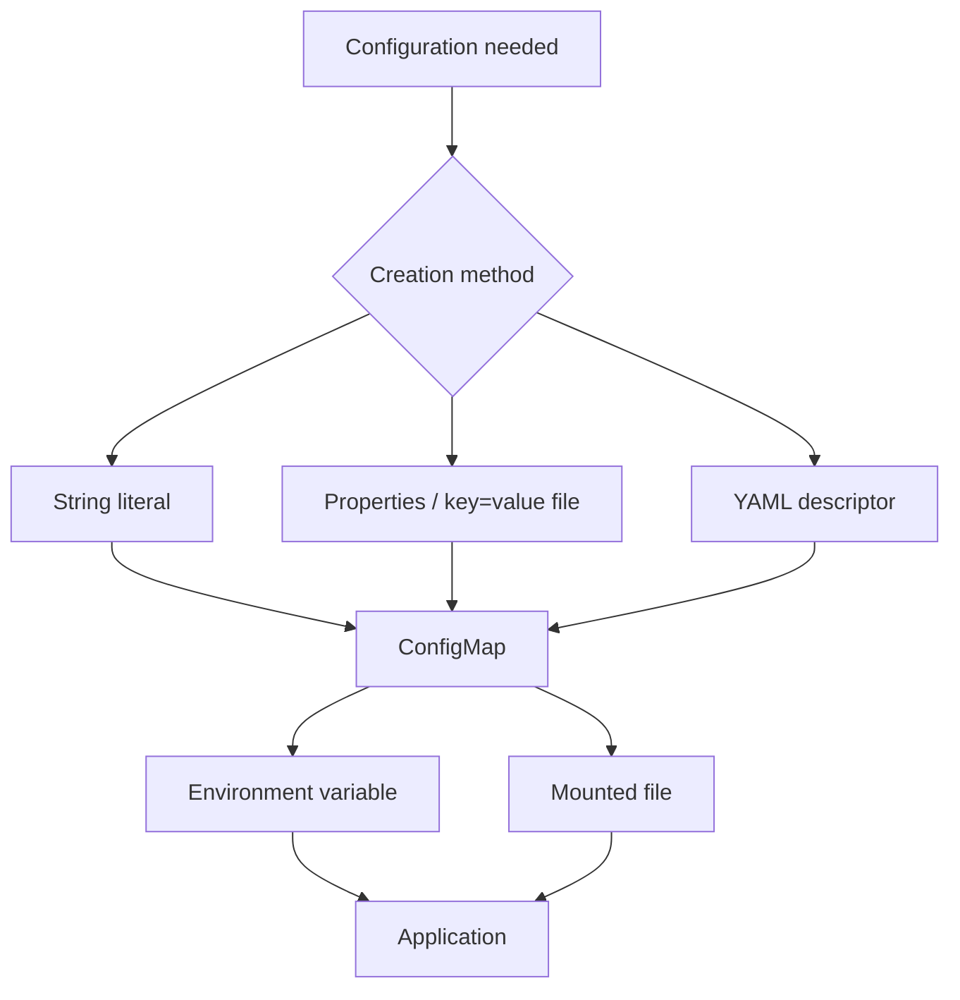
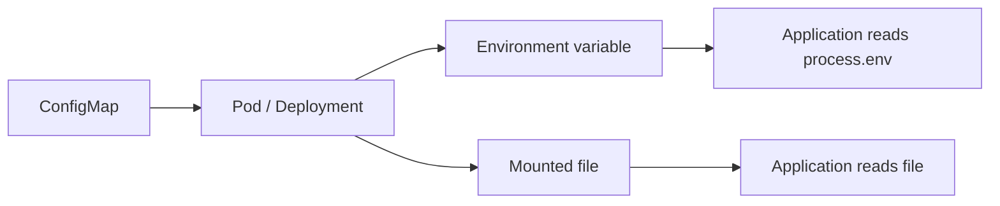

# ConfigMaps and Secrets

## Kubernetes ConfigMaps and Secrets — Comprehensive Technical Notes

> **Source basis:** `ConfigMaps and Secrets.txt`, `ConfigMaps and Secrets-subtitles-en.vtt`, and `ConfigMaps and Secrets.mp4`
>
> **Completeness:** The TXT and VTT spoken text were compared after whitespace normalization and matched exactly. The complete timestamped transcript is retained near the end of this document.
>
> **Video analysis:** The MP4 was inspected for slides, YAML, commands, terminal output, application behavior, environment-variable references, encoded Secret data, and volume-mount configuration.
>
> **Live examples:** Wherever the lesson gives a partial/generic command such as “get command,” “describe command,” or “from file flag,” a concrete example is provided immediately afterward and explicitly labeled as a live example.

### Visual Study Diagram

<figure><figcaption></figcaption></figure>


## 1. Learning Objectives

After watching this video, you will be able to:

1. **Identify important ConfigMap characteristics.**
2. **Describe ConfigMap capabilities.**
3. **Describe three ways to create a ConfigMap.**
4. **Describe three ways to create a Secret.**

***

## 2. Why Keep Configuration Outside Application Code?

As a software-development practice, the lesson recommends avoiding hard-coding configuration variables directly in application code.

Instead, keep configuration variables separate so that:

```
Configuration changes
        |
        v
Configuration settings change
        |
        v
Application code does NOT need to change
```

This separates the application's configuration from the application code itself.

***

## 3. ConfigMap

### 3.1 What Is a ConfigMap?

A **ConfigMap** is a Kubernetes API object that stores **non-confidential data in key-value pairs**.

It is intended for **non-sensitive information**.

A ConfigMap:

* Helps developers avoid hard-coding configuration variables into application code.
* Stores non-confidential data in key-value pairs.
* Does **not** provide secrecy or encryption.
* Provides configuration data to pods and deployments.
* Separates configuration from application code.

### 3.2 ConfigMap Size Limitation

The lesson states that:

> Data stored in a ConfigMap cannot exceed **one megabyte**.

For larger amounts of data, the lesson recommends considering:

* Mounting a volume.
* A separate database.
* A separate file service.

#### Decision Concept

```
Configuration data
       |
       +---- <= 1 MB ----> ConfigMap
       |
       +---- > 1 MB ----> Consider volume / database / file service
```

### 3.3 ConfigMap Fields and Naming

The lesson states that a ConfigMap has:

* Optional `data` field.
* Optional `binaryData` field.
* No `spec` field in the template.
* A name that must be a valid **DNS subdomain name**.

***

## 4. ConfigMap Capabilities

A ConfigMap is reusable across deployments, making it portable and helping to decouple the environment from the deployments themselves.

### Key Capabilities

| Capability                       | Description                                                                           |
| -------------------------------- | ------------------------------------------------------------------------------------- |
| **Portable**                     | A ConfigMap can be reused across deployments.                                         |
| **Reusable**                     | Multiple deployments can reference the same configuration.                            |
| **Decoupled configuration**      | Environment configuration is separated from deployments/application code.             |
| **Non-confidential storage**     | Intended for configuration that is not sensitive.                                     |
| **Multiple creation methods**    | Can be created using string literals, a properties/key-value file, or YAML.           |
| **Multiple consumption methods** | Can be referenced by pods/deployments through environment variables or mounted files. |

***

## 5. Three Ways to Create a ConfigMap

The lesson identifies three creation methods:

1. **String literals**
2. **Existing properties / `key=value` file**
3. **ConfigMap YAML descriptor**

The lesson also says the first and second methods can help create a YAML file.

***

## 6. How Pods and Deployments Consume a ConfigMap

The lesson describes two ways for a pod or deployment to consume a ConfigMap.

### Method 1 — Environment Variables

A deployment or pod can reference a ConfigMap key through an environment variable using `configMapKeyRef`.

The video shows:

```yaml
env:
  - name: MESSAGE
    valueFrom:
      configMapKeyRef:
        name: my-config
        key: MESSAGE
```

The relationship is:

```
ConfigMap
   |
   | key = MESSAGE
   v
configMapKeyRef
   |
   v
Environment variable MESSAGE
   |
   v
Application
```

### Method 2 — Mounted File

The lesson also states that configuration can be supplied by mounting a file using volumes.

The lesson explains that Kubernetes applies the ConfigMap to the pod or deployment just before the pod or deployment runs.

***

## 7. Environment Variable Example Before Using a ConfigMap

The lesson first demonstrates configuration directly in the Deployment YAML.

The video shows an environment variable section similar to:

```yaml
env:
  - name: MESSAGE
    value: "Hello from config file!"
```

The application uses the environment variable in JavaScript as:

```javascript
process.env.message
```

> **Source-fidelity note:** The video visibly shows the environment variable name as `MESSAGE`, while the narration describes the JavaScript access as `process.env.message`. This document preserves both forms rather than silently changing either one.

The deployment is then applied and the application displays:

```
hello from the config file
```

The lesson says the result is excellent, but the message is now hard-coded in the descriptor file.

That leads to the use of a ConfigMap.

***

## 8. Creating a ConfigMap with a String Literal

The simplest method presented is to provide a key-value pair directly in the ConfigMap command.

### Video command

```bash
kubectl create ConfigMap my-config --from-literal=MESSAGE="hello from first configmap"
```

The video shows output equivalent to:

```
ConfigMap/my-config created
```

#### Live example

```bash
kubectl create configmap my-config --from-literal=MESSAGE="hello from first configmap"
```

The application then displays:

```
hello from first configmap
```

***

## 9. Connecting the String-Literal ConfigMap to a Deployment

After creating the ConfigMap, the next step is to tell the Deployment where the new `MESSAGE` variable should be obtained.

The video shows:

```yaml
env:
  - name: MESSAGE
    valueFrom:
      configMapKeyRef:
        name: my-config
        key: MESSAGE
```

This means:

```
Deployment
    |
    +--> env: MESSAGE
             |
             +--> valueFrom
                    |
                    +--> configMapKeyRef
                           |
                           +--> name: my-config
                           |
                           +--> key: MESSAGE
```

In this case, the deployment looks for:

* ConfigMap name: `my-config`
* ConfigMap key: `MESSAGE`

***

## 10. Creating a ConfigMap from a Properties / Key-Value File

Another method is to use a file containing environment variables in `key=value` format.

This method is useful when many variables must be added instead of listing each variable individually on the command line.

### Example file

The video shows a file named:

```
my.properties
```

Contents:

```properties
MESSAGE=hello from the my.properties file
```

#### Display the file

The video shows:

```bash
cat my.properties
```

#### Live example

```bash
cat my.properties
```

***

## 11. Create ConfigMap from the Properties File

The video shows:

```bash
kubectl create cm my-config --from-file=my.properties
```

The resulting output is:

```
ConfigMap/my-config created
```

#### Live example

```bash
kubectl create configmap my-config --from-file=my.properties
```

The lesson notes an important detail:

> The key is `my.properties` in the deployment descriptor section.

The video shows the environment reference:

```yaml
env:
  - name: MESSAGE
    valueFrom:
      configMapKeyRef:
        name: my-config
        key: my.properties
```

> **Source-fidelity note:** This differs from the earlier string-literal example, where the key is `MESSAGE`. The lesson demonstrates the file-based ConfigMap as storing the file under the key `my.properties`.

The application output shown is associated with:

```
MESSAGE=hello from the my.properties file
```

***

## 12. Using the ConfigMap in the Application

The lesson says that in the `server.js` file, the configuration is referred to as:

```javascript
process.env.message
```

This allows the application to read the environment variable instead of hard-coding the message.

***

## 13. Inspecting the ConfigMap

The lesson instructs you to use the **describe** command to get the YAML/output details and then view the environment section.

The video shows:

```bash
kubectl describe ConfigMap my-config
```

#### Live example

```bash
kubectl describe configmap my-config
```

This shows information such as:

* Name.
* Namespace.
* Labels.
* Annotations.
* Data.
* The stored `my.properties` content.

***

## 14. Loading a Directory into a ConfigMap

The lesson states:

> If you specify a directory to the `--from-file` flag, the entire directory is loaded into the ConfigMap.

#### Generic pattern

```bash
kubectl create configmap <configmap-name> --from-file=<directory>
```

#### Live example

```bash
kubectl create configmap my-config --from-file=./config/
```

> **Added live example:** The directory path `./config/` is a concrete example illustrating the source's directory behavior; the lesson itself does not provide this exact directory name.

***

## 15. Loading a Specific File with a Custom Key

The lesson also states that a specific file can be loaded with a specified key using:

```
--from-file=<key>=<file-name>
```

#### Live example

```bash
kubectl create configmap my-config --from-file=app.properties=./config/app.properties
```

This associates the uploaded file with the ConfigMap key:

```
app.properties
```

> **Added live example:** The file and key names here are concrete examples illustrating the source's `key=file-name` syntax.

***

## 16. Creating a ConfigMap with YAML

The third method is to define a ConfigMap in a YAML descriptor file and apply it.

The video shows the process.

### Step 1 — Check existing ConfigMaps

```bash
kubectl get cm
```

The video shows:

```
No resources found in default namespace.
```

### Step 2 — Create the YAML file

The displayed file is:

```
my-config.yaml
```

The video shows content equivalent to:

```yaml
apiVersion: v1
kind: ConfigMap
metadata:
  name: my-config
  namespace: default
data:
  my-properties: |-
    MESSAGE=hello from the
    my.properties file
```

> **Source-observed note:** The video wraps the text visually across lines. The important stored value is the `my.properties` entry containing the `MESSAGE=hello from the my.properties file` content.

### Step 3 — Apply the YAML

The video shows:

```bash
kubectl apply -f my-config.YAML
```

#### Live example

```bash
kubectl apply -f my-config.yaml
```

The output is:

```
ConfigMap/my-config created
```

The video then describes the ConfigMap and displays the same message data.

### Result

The lesson states that using the YAML file produces the **same results as the other methods**.

***

## 17. ConfigMap Creation Workflow



***

## 18. Secret

Working with a Secret is described as similar to working with a ConfigMap.

A Secret is used to provide **sensitive information** to an application.

The lesson demonstrates:

1. Creating a Secret using a string literal.
2. Verifying the Secret using `get`.
3. Describing the Secret to verify the data is not displayed as clear text.
4. Printing the Secret as YAML and seeing an encoded value.
5. Using the Secret as an environment variable.
6. Using the Secret through a volume mount.

***

## 19. Secret Characteristics

### Purpose

A Secret is used for sensitive information.

The video example contains an API credential:

```
api-creds
```

and a key:

```
key
```

with the source value:

```
mysupersecretapikey
```

#### ConfigMap vs Secret

| Aspect                       | ConfigMap                      | Secret                          |
| ---------------------------- | ------------------------------ | ------------------------------- |
| Intended data                | Non-confidential configuration | Sensitive information           |
| Secrecy                      | Does not provide secrecy       | Used for sensitive information  |
| Example                      | `MESSAGE`                      | API credential                  |
| Environment-variable usage   | Yes                            | Yes                             |
| Volume-mount usage           | Yes                            | Yes                             |
| Video encoding demonstration | Not emphasized                 | YAML output shows encoded value |

***

## 20. Create a Secret Using a String Literal

The video shows:

```bash
kubectl create secret generic api-creds --from-literal=key=mysupersecretapikey
```

The output is:

```
secret/api-creds created
```

#### Live example

```bash
kubectl create secret generic api-creds --from-literal=key=mysupersecretapikey
```

***

## 21. Verify the Secret

The video uses the `get` command:

```bash
kubectl get secret
```

#### Live example

```bash
kubectl get secret
```

The video shows the Secret in a table similar to:

```
NAME        TYPE     DATA   AGE
api-creds   Opaque   1      5s
```

This verifies that the Secret exists.

***

## 22. Describe the Secret

The next step is to use the `describe` command:

```bash
kubectl describe secret api-creds
```

#### Live example

```bash
kubectl describe secret api-creds
```

The video shows information similar to:

```
Name:        api-creds
Namespace:   default
Labels:      <none>
Annotations: <none>
Type:        Opaque
Data
====
key:         19 bytes
```

The lesson says this demonstrates that the actual secret value is not displayed as plain display text.

***

## 23. Print the Secret as YAML

The lesson then says you can print the Secret in YAML format.

The video shows:

```bash
kubectl get secret api-creds -o YAML
```

#### Live example

```bash
kubectl get secret api-creds -o yaml
```

The video displays an output containing:

```yaml
apiVersion: v1
data:
  key: bXlzdXBlcnNlY3JldGFwaWtleQ==
kind: Secret
metadata:
  creationTimestamp: "2020-03-29T23:58:05Z"
  name: api-creds
  namespace: default
  resourceVersion: "196306"
  selfLink: /api/v1/namespaces/default/secrets/api-creds
  uid: 68b6d4b3-e0b4-4dc8-a3f2-62cae3a330b7
type: Opaque
```

The value shown for `key` is:

```
bXlzdXBlcnNlY3JldGFwaWtleQ==
```

The source lesson describes this as **fully encoded**.

> **Source-fidelity note:** The Kubernetes API's representation shown in this video is base64-encoded data. The source lesson's wording is preserved as “fully encoded”; this document does not add a claim that base64 by itself constitutes encryption.

***

## 24. Use a Secret as an Environment Variable

To use the Secret, the lesson says to add another environment variable to the Deployment descriptor.

The video shows:

```yaml
env:
  - name: API_CREDS
    valueFrom:
      secretKeyRef:
        name: api-creds
        key: key
```

This maps:

```
Secret
  api-creds
      |
      +--> key
             |
             v
secretKeyRef
      |
      v
Environment variable: API_CREDS
```

The application then refers to the value as:

```javascript
process.env.API_CREDS
```

The video screenshot displays:

```
Key: API_CREDS
Value = mysupersecretapikey
```

along with other environment variables from the Node.js application.

***

## 25. Secret Through a Volume Mount

Another way to use the Secret key in the application is with **volume mounts**.

The lesson's sequence is:

1. Create the same Secret as before.
2. In the descriptor YAML, use a volume for the Secret.
3. Add a corresponding volume mount.

The video shows:

```bash
kubectl create secret generic api-creds --from-literal=key=mysupersecretapikey
```

#### Live example

```bash
kubectl create secret generic api-creds --from-literal=key=mysupersecretapikey
```

***

## 26. Secret Volume Mount YAML

The video shows the relevant Deployment configuration:

```yaml
spec:
  containers:
    - name: hello-kubernetes
      image: upkar/myapp:latest
      ports:
        - containerPort: 8080
      volumeMounts:
        - name: api-creds
          mountPath: "/etc/api"
          readonly: true
  volumes:
    - name: api-creds
      secret:
        secretName: api-creds
```

### Important Fields

| Field               | Value shown | Purpose in the lesson                       |
| ------------------- | ----------- | ------------------------------------------- |
| `volumeMounts.name` | `api-creds` | Connects the container mount to the volume. |
| `mountPath`         | `/etc/api`  | Location where the Secret is mounted.       |
| `readonly`          | `true`      | Mount is read-only in the video.            |
| `volumes.name`      | `api-creds` | Names the volume.                           |
| `secret.secretName` | `api-creds` | Connects the volume to the Secret.          |

The lesson says the `api-creds` Secret is mounted as a file at:

```
/etc/api
```

and that the application reads and processes the file to extract the Secret.

***

## 27. Multiple Containers and Shared Volumes

The lesson explains:

> Each container in the descriptor file has its own volume mount, but shares the volume.

Conceptually:

```
                 Secret: api-creds
                        |
                        v
                  Shared Volume
                   /         \
                  /           \
          Container A       Container B
            mount             mount
              |                 |
              +------ read -----+
```

The containers have their own `volumeMounts` entries while referencing the shared volume.

***

## 28. ConfigMap Consumption Flow



***

## 29. Secret Consumption Flow

```mermaid
flowchart LR
    A[Secret] --> B[Pod / Deployment]
    B --> C[secretKeyRef]
    B --> D[Secret volume]
    C --> E[process.env.API_CREDS]
    D --> F[/etc/api/... file]
    E --> G[Application]
    F --> G
```

***

## 30. End-to-End ConfigMap Workflow

```
1. Define configuration
        |
        v
2. Create ConfigMap
   +---------------------------+
   | String literal             |
   | Properties / key=value     |
   | YAML descriptor            |
   +---------------------------+
        |
        v
3. Reference ConfigMap
   +---------------------------+
   | Environment variable       |
   | Mounted file / volume      |
   +---------------------------+
        |
        v
4. Kubernetes supplies it to pod/deployment
        |
        v
5. Application reads configuration
```

***

## 31. End-to-End Secret Workflow

```
1. Define sensitive value
        |
        v
2. Create Secret
        |
        +------------------------+
        |                        |
        v                        v
   Environment variable     Volume mount
        |                        |
        v                        v
 process.env.API_CREDS       Secret file
        |                        |
        +-----------+------------+
                    |
                    v
              Application
```

***

## 32. Command Reference

### ConfigMap Commands

| Purpose                | Command concept from lesson           | Complete / live example                                                                  |
| ---------------------- | ------------------------------------- | ---------------------------------------------------------------------------------------- |
| List ConfigMaps        | `get cm`                              | `kubectl get cm`                                                                         |
| Create from literal    | `create ConfigMap ... --from-literal` | `kubectl create configmap my-config --from-literal=MESSAGE="hello from first configmap"` |
| Create from file       | `create cm ... --from-file`           | `kubectl create configmap my-config --from-file=my.properties`                           |
| Create from directory  | `--from-file=<directory>`             | `kubectl create configmap my-config --from-file=./config/`                               |
| Create with custom key | `--from-file=<key>=<file>`            | `kubectl create configmap my-config --from-file=app.properties=./config/app.properties`  |
| Inspect ConfigMap      | `describe`                            | `kubectl describe configmap my-config`                                                   |
| Apply YAML             | `apply -f`                            | `kubectl apply -f my-config.yaml`                                                        |

### Secret Commands

| Purpose                    | Command concept from lesson                | Complete / live example                                                          |
| -------------------------- | ------------------------------------------ | -------------------------------------------------------------------------------- |
| Create Secret from literal | `create secret generic ... --from-literal` | `kubectl create secret generic api-creds --from-literal=key=mysupersecretapikey` |
| List Secrets               | `get secret`                               | `kubectl get secret`                                                             |
| Describe Secret            | `describe secret`                          | `kubectl describe secret api-creds`                                              |
| Print Secret as YAML       | `get secret ... -o YAML`                   | `kubectl get secret api-creds -o yaml`                                           |

***

## 33. Exact Source Commands Seen in the Video

### ConfigMap

```bash
kubectl create ConfigMap my-config --from-literal=MESSAGE="hello from first configmap"
```

```bash
cat my.properties
```

```bash
kubectl create cm my-config --from-file=my.properties
```

```bash
kubectl describe ConfigMap my-config
```

```bash
kubectl get cm
```

```bash
cat my-config.yaml
```

```bash
kubectl apply -f my-config.YAML
```

### Secret

```bash
kubectl create secret generic api-creds --from-literal=key=mysupersecretapikey
```

```bash
kubectl get secret
```

```bash
kubectl describe secret api-creds
```

```bash
kubectl get secret api-creds -o YAML
```

***

## 34. Live Command Examples for Generic / Half-Filled Source Instructions

The lesson sometimes names a command without giving the entire command.

### “Use the get command”

```bash
kubectl get secret
```

### “Use the describe command”

```bash
kubectl describe secret api-creds
```

### “Use the from file flag”

```bash
kubectl create configmap my-config --from-file=my.properties
```

### “Specify a directory to the from file flag”

```bash
kubectl create configmap my-config --from-file=./config/
```

### “Use the from file equals key equals file name format”

```bash
kubectl create configmap my-config --from-file=app.properties=./config/app.properties
```

### “Apply the YAML file”

```bash
kubectl apply -f my-config.yaml
```

### “Print out the secret in YAML format”

```bash
kubectl get secret api-creds -o yaml
```

***

## 35. Example Deployment YAML — ConfigMap Environment Variable

The video shows a Deployment using the ConfigMap key as an environment variable:

```yaml
apiVersion: apps/v1
kind: Deployment
metadata:
  name: hello-kubernetes
  labels:
    app: hello-kubernetes
spec:
  replicas: 1
  selector:
    matchLabels:
      app: hello-kubernetes
  template:
    metadata:
      labels:
        app: hello-kubernetes
    spec:
      containers:
        - name: hello-kubernetes
          image: upkar/myapp:latest
          ports:
            - containerPort: 8080
          env:
            - name: MESSAGE
              valueFrom:
                configMapKeyRef:
                  name: my-config
                  key: MESSAGE
```

***

## 36. Example Deployment YAML — Secret Environment Variable

```yaml
env:
  - name: API_CREDS
    valueFrom:
      secretKeyRef:
        name: api-creds
        key: key
```

Application-side reference:

```javascript
process.env.API_CREDS
```

***

## 37. Example Deployment YAML — Secret Volume Mount

```yaml
spec:
  containers:
    - name: hello-kubernetes
      image: upkar/myapp:latest
      ports:
        - containerPort: 8080
      volumeMounts:
        - name: api-creds
          mountPath: "/etc/api"
          readonly: true
  volumes:
    - name: api-creds
      secret:
        secretName: api-creds
```

***

## 38. ConfigMap Creation Comparison

| Method              | Source input              | Main idea                                    | Example                                               |
| ------------------- | ------------------------- | -------------------------------------------- | ----------------------------------------------------- |
| **String literal**  | Key/value on command line | Directly create a key                        | `--from-literal=MESSAGE="hello from first configmap"` |
| **Properties file** | Existing `key=value` file | Load one or many entries from a file         | `--from-file=my.properties`                           |
| **YAML descriptor** | ConfigMap YAML            | Define the object declaratively and apply it | `kubectl apply -f my-config.yaml`                     |

***

## 39. Secret Usage Comparison

| Method                         | Source description                                                       | Example                                                |
| ------------------------------ | ------------------------------------------------------------------------ | ------------------------------------------------------ |
| **String literal creation**    | Create the secret from a literal value                                   | `kubectl create secret generic ... --from-literal=...` |
| **Environment variable usage** | Inject the Secret value into an environment variable with `secretKeyRef` | `process.env.API_CREDS`                                |
| **Volume mount usage**         | Mount the Secret as a file                                               | `/etc/api`                                             |

> **Source wording note:** The final recap describes the three Secret approaches as “using a string literal,” “using environment variables,” and “using volume mounts.” Earlier in the lesson, environment variables and volume mounts are specifically demonstrated as **ways to consume** the Secret. Both framings are preserved.

***

## 40. Important Technical Distinctions From the Lesson

### ConfigMap

Use for:

```
Non-sensitive configuration
```

Examples from the lesson:

```
MESSAGE
Environment-specific configuration
Application configuration
```

Do not treat a ConfigMap as a mechanism for secrecy or encryption.

### Secret

Use for:

```
Sensitive information
```

The lesson's example is:

```
API credentials
```

The Secret value is not printed as clear display text by `kubectl describe`, and the YAML representation shown in the video contains an encoded value.

***

## 41. ConfigMap vs Secret — Quick Mind Map

```
                         Kubernetes Configuration
                                  |
                    +-------------+-------------+
                    |                           |
               ConfigMap                     Secret
                    |                           |
             Non-confidential              Sensitive
                    |                           |
          +---------+---------+          +------+------+
          |                   |          |             |
    Environment          Volume      Environment    Volume
      variable            mount        variable      mount
          |                   |          |             |
     process.env          File       process.env    Secret file
```

***

## 42. Recap

The video concludes that:

* You can use a **ConfigMap** to provide variables for your application.
* You can create a ConfigMap:
  * using a string literal,
  * using a properties file,
  * or using YAML.
* You can use a **Secret** to provide sensitive information to your application.
* The lesson's final recap says you can create/use a Secret:
  * using a string literal,
  * using environment variables,
  * or using volume mounts.

***

## 43. Complete Timestamped Transcript

> This section preserves the complete spoken transcript from the supplied VTT. The wording is not summarized or silently corrected.

**00:00:07.000 → 00:00:11.300**

Welcome to Config Maps and Secrets.

**00:00:11.300 → 00:00:14.100**

After watching this video, you will be able to

**00:00:14.100 → 00:00:17.500**

Identify important config map characteristics

**00:00:17.500 → 00:00:20.000**

Describe config map capabilities

**00:00:20.000 → 00:00:22.899**

Describe three ways to create a config map

**00:00:22.899 → 00:00:27.399**

and Describe three ways to create a secret

**00:00:27.399 → 00:00:30.500**

As software developers, a good practice to adopt

**00:00:30.500 → 00:00:33.099**

is to avoid hard-coding configuration variables

**00:00:33.099 → 00:00:34.599**

in application code

**00:00:34.599 → 00:00:37.200**

by keeping the configuration variables separate

**00:00:37.200 → 00:00:39.599**

so that any changes in configuration settings

**00:00:39.599 → 00:00:42.000**

do not require code changes.

**00:00:42.000 → 00:00:44.200**

A config map is an API object

**00:00:44.200 → 00:00:48.000**

that stores non-confidential data in key-value pairs

**00:00:48.000 → 00:00:50.400**

and is meant for non-sensitive information

**00:00:50.400 → 00:00:53.599**

as they do not provide secrecy or encryption.

**00:00:53.599 → 00:00:56.900**

In addition, a config map provides configuration data

**00:00:56.900 → 00:00:58.500**

to pods and deployments

**00:00:58.500 → 00:01:00.299**

so that the configuration data

**00:01:00.299 → 00:01:03.700**

is not hard-coded inside the application code.

**00:01:03.700 → 00:01:07.699**

Data stored in a config map cannot exceed one megabyte.

**00:01:07.699 → 00:01:09.300**

For larger amounts of data,

**00:01:09.300 → 00:01:10.900**

consider mounting a volume

**00:01:10.900 → 00:01:14.300**

or use a separate database or file service.

**00:01:14.300 → 00:01:18.099**

A config map has optional data and binary data fields

**00:01:18.099 → 00:01:22.099**

and in this case, there is no spec field in the template

**00:01:22.199 → 00:01:27.699**

and the config name must be a valid DNS subdomain name.

**00:01:27.699 → 00:01:31.000**

A config map is reusable for multiple deployments,

**00:01:31.000 → 00:01:33.000**

thus decoupling the environment

**00:01:33.000 → 00:01:35.300**

from the deployments themselves.

**00:01:35.300 → 00:01:39.000**

You can create a config map by using string literals,

**00:01:39.000 → 00:01:43.400**

by using an existing properties or key equals value file

**00:01:43.400 → 00:01:48.099**

or by providing a config map YAML descriptor file.

**00:01:48.099 → 00:01:49.900**

You can use the first and second ways

**00:01:49.900 → 00:01:52.300**

to help create such a YAML file.

**00:01:52.300 → 00:01:55.300**

The deployment or pods consume a config map

**00:01:55.300 → 00:01:57.199**

by using environment variables

**00:01:57.199 → 00:01:59.900**

with the config map key ref attribute

**00:01:59.900 → 00:02:03.699**

or by mounting a file using the volumes plugin.

**00:02:03.699 → 00:02:06.500**

Kubernetes applies the config map to the pod

**00:02:06.500 → 00:02:11.199**

or the deployment just before running the pod or deployment.

**00:02:11.199 → 00:02:13.500**

You'll use the environment variable directly

**00:02:13.500 → 00:02:15.300**

in the YAML file.

**00:02:15.300 → 00:02:18.000**

The message variable is used in the JavaScript file

**00:02:18.000 → 00:02:22.300**

as process.env.message.

**00:02:22.300 → 00:02:25.000**

Apply this development descriptor to our deployment

**00:02:25.000 → 00:02:27.100**

and the application displays the string

**00:02:27.100 → 00:02:29.600**

hello from the config file.

**00:02:29.600 → 00:02:31.199**

The result is excellent,

**00:02:31.199 → 00:02:34.399**

but the message is hard-coded in the descriptor file.

**00:02:34.399 → 00:02:38.199**

Let's change this situation by using a config map.

**00:02:38.199 → 00:02:40.300**

The simplest way to provide a config map

**00:02:40.300 → 00:02:42.399**

is to provide a key value pair

**00:02:42.399 → 00:02:45.399**

in the center of the config map command.

**00:02:45.399 → 00:02:46.800**

After this first step,

**00:02:46.899 → 00:02:49.100**

the second step is to tell our deployment

**00:02:49.100 → 00:02:50.899**

about the new message variable

**00:02:50.899 → 00:02:53.699**

and specify its location for pickup.

**00:02:53.699 → 00:02:56.699**

You do that by adding the environment section

**00:02:56.699 → 00:02:59.199**

in the deployment descriptor as shown

**00:02:59.199 → 00:03:01.699**

and using the value from attribute

**00:03:01.699 → 00:03:05.100**

to point to the config map created in the first step.

**00:03:05.100 → 00:03:06.199**

In this case,

**00:03:06.199 → 00:03:08.800**

the deployment will look for a key named message

**00:03:08.800 → 00:03:12.600**

in the config map named myconfig.

**00:03:12.600 → 00:03:15.899**

Another way to add the message variable in the config map

**00:03:15.899 → 00:03:19.199**

is to use a file that contains all environment variables

**00:03:19.199 → 00:03:21.800**

in the key equals value format.

**00:03:21.800 → 00:03:24.699**

Such a file is useful for adding many variables

**00:03:24.699 → 00:03:27.199**

instead of listing those variables one by one

**00:03:27.199 → 00:03:28.699**

on the command line.

**00:03:28.699 → 00:03:31.300**

Here is a file with just one message key

**00:03:31.300 → 00:03:35.500**

and a value hello from the my.properties file.

**00:03:35.500 → 00:03:37.199**

You can now create the config map

**00:03:37.199 → 00:03:40.199**

by using the from file flag.

**00:03:40.199 → 00:03:42.800**

Notice that the key is my.properties

**00:03:42.800 → 00:03:45.399**

in the deployment descriptor section.

**00:03:45.399 → 00:03:48.800**

To use the config map in the server.js file,

**00:03:48.800 → 00:03:53.699**

refer to it as process.env.message.

**00:03:53.699 → 00:03:57.500**

Use the describe command to get the YAML output.

**00:03:57.500 → 00:04:00.000**

Then view the environment section.

**00:04:00.000 → 00:04:04.100**

If you specify a directory to the from file flag,

**00:04:04.100 → 00:04:07.699**

the entire directory is loaded into the config map.

**00:04:07.699 → 00:04:10.500**

You can also load a specific file with a key

**00:04:10.500 → 00:04:16.700**

by using the from file equals key equals file name format.

**00:04:16.700 → 00:04:20.899**

Finally, you can use a YAML file with the config map descriptor

**00:04:20.899 → 00:04:22.799**

and apply that file.

**00:04:22.799 → 00:04:26.100**

In our case, we have saved the output from kubectl

**00:04:26.100 → 00:04:27.799**

to get config map.

**00:04:27.799 → 00:04:33.700**

To get config map as a YAML file called my-config.yaml.

**00:04:33.700 → 00:04:36.500**

The first command indicates that there is no config map

**00:04:36.500 → 00:04:37.899**

to begin with.

**00:04:37.899 → 00:04:41.899**

Here, you are creating the config map.yaml file.

**00:04:41.899 → 00:04:44.500**

You'll now apply the YAML file to your cluster,

**00:04:44.500 → 00:04:46.899**

which creates the config map.

**00:04:46.899 → 00:04:50.700**

Note the message in the config map file description.

**00:04:50.700 → 00:04:53.399**

Using the YAML file will get you the same results

**00:04:53.399 → 00:04:56.299**

as the other methods.

**00:04:56.299 → 00:05:00.500**

Now, working with a secret is like working with a config map.

**00:05:00.500 → 00:05:04.000**

First, create a secret using a string literal.

**00:05:04.000 → 00:05:08.500**

Next, the get command verifies that the secret was created.

**00:05:08.500 → 00:05:12.299**

Finally, to prove that our secret is indeed a secret,

**00:05:12.299 → 00:05:14.700**

use the describe command and check

**00:05:14.700 → 00:05:19.899**

that you don't see any secret written using display text.

**00:05:19.899 → 00:05:22.899**

You can print out the secret in YAML format,

**00:05:22.899 → 00:05:27.399**

and you'll see that the value is fully encoded.

**00:05:27.399 → 00:05:29.600**

To use the secret, add another environment

**00:05:29.600 → 00:05:31.799**

to the deployment descriptor as shown,

**00:05:31.799 → 00:05:33.700**

and then use the application key

**00:05:33.700 → 00:05:41.299**

by referring to the application as process.env.API\_CREDS.

**00:05:41.299 → 00:05:43.000**

The screenshot displays the secret

**00:05:43.000 → 00:05:45.299**

along with other environmental variables

**00:05:45.299 → 00:05:48.500**

from the node.js file.

**00:05:48.500 → 00:05:51.399**

Another way to use the secret key in your application

**00:05:51.399 → 00:05:53.399**

is to use volume mounts.

**00:05:53.399 → 00:05:56.399**

Create the same secret as done previously.

**00:05:56.399 → 00:05:59.799**

In the descriptor YAML file, use a volume for the secret

**00:05:59.799 → 00:06:02.200**

with a corresponding volume mount.

**00:06:02.200 → 00:06:04.200**

Each container in the descriptor file

**00:06:04.200 → 00:06:07.799**

has its own volume mount, but shares the volume.

**00:06:07.799 → 00:06:14.000**

The api-creds secret is mounted as a file at etc/API,

**00:06:14.000 → 00:06:16.799**

and the application will read and process the file

**00:06:16.799 → 00:06:19.899**

to extract the secret.

**00:06:19.899 → 00:06:22.399**

In this video, you learned that you

**00:06:22.399 → 00:06:26.500**

can use a config map to provide variables for your application.

**00:06:26.500 → 00:06:29.600**

You can create a config map by using a string literal,

**00:06:29.600 → 00:06:33.000**

by using a properties file, or by using YAML.

**00:06:33.000 → 00:06:35.600**

You can use a secret to provide sensitive information

**00:06:35.600 → 00:06:37.100**

to your application.

**00:06:37.100 → 00:06:40.000**

And you can create a secret by using a string literal,

**00:06:40.000 → 00:06:44.799**

by using environment variables, or by using volume mounts.

***
