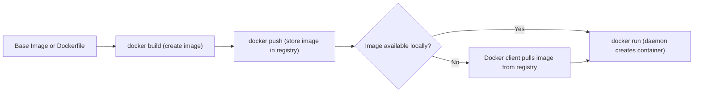

# Docker\_Architecture

<figure><figcaption></figcaption></figure>

> Source video: [Docker Architecture — Coursera (IBM: Containers & Kubernetes)](https://www.coursera.org/learn/ibm-containers-docker-kubernetes-openshift/lecture/5ZK8J/docker-architecture)

## Learning Objectives

After watching this video, you will be able to:

* Identify the components of the Docker architecture
* Explain the features of the Docker architecture components
* Describe the process of containerization using Docker

## Overview

The Docker client-server architecture provides a complete application environment. Docker components include:

* **The Client**
* **The Host**
* **The Registry**

## High-Level View of How Docker Works

You use either the **Docker command line interface (CLI)** or **REST APIs**, via the Docker client, to send instructions to the Docker host server, commonly called the **host**.

### The Docker Host

* The Docker host contains the daemon known as **`dockerd`**.
* The daemon listens for Docker API requests or commands (such as `docker run`) and processes those commands.
* The daemon does the heavy lifting to build, run, and distribute Docker containers.
* Docker stores the container images in a **registry**.
* The Docker host also includes and manages:
  * Images
  * Containers
  * Namespace networks
  * Storage plugins
  * Add-ons

### The Docker Client

* You can use the Docker client to communicate with **local and remote** Docker hosts.
* You can run the Docker client and daemon on the same system, **or** connect your Docker client to a remote Docker daemon.
* Docker daemons can also communicate with other daemons to manage Docker services.

## The Registry

Docker stores and distributes images in a registry.

| Registry Access Type | Description                              | Example                                         |
| -------------------- | ---------------------------------------- | ----------------------------------------------- |
| **Public**           | Accessible by everyone                   | Docker Hub                                      |
| **Private**          | Used by enterprises for security reasons | Hosted by a third-party provider or self-hosted |

### Registry Hosting Options

* Hosted by a third-party provider, such as **IBM Cloud Container Registry**
* Self-hosted in private data centers
* Self-hosted on the cloud

### Moving Images Into the Registry



## Build and push the images

Developers build and push the images — using automation or a build pipeline — into a registry, where Docker stores these images.



## Pull the images

Local machines, cloud systems, and on-premises systems can then **pull** those images.



## Visual Representation of the Docker Architecture

The Docker architecture consists of:

1. **The Client** — issues commands
2. **The Docker Host** — including the Docker daemon (`dockerd`)
3. **The Registry** — with its existing stored images

## The Containerization Process

Containerization is the process used to build, push, and run an image to create a running container.

### Steps to Create and Run a Container Image



## Start from an existing base image or a Dockerfile

Provides the foundation for the new image.



## Build the image

```bash
docker build
```

Creates a container image with a name.



## Push the image

```bash
docker push
```

Stores the image to the registry.



## Run the container

```bash
docker run
```

Checks locally for the image, then creates the container.



### Detailed Command Reference

```bash
docker build
```

Creates a container image with a name, using an existing base image or a Dockerfile.

```bash
docker push
```

Stores (uploads) the built image to the registry.

```bash
docker run
```

Issued with the image name to create the container. Behavior:

* The host **first checks locally** if the image is already available.
* If the image **is available locally**, the daemon creates a running container using that image directly.
* If the image **is unavailable** within the host, the Docker client connects to the registry and **pulls** the image to the host before the daemon creates the running container.

### Containerization Workflow Summary



## Summary

In this video, you learned that:

* Docker architecture consists of a **Docker client**, a **Docker host**, and a **registry**.
* The client interacts with the host using commands and REST APIs.
* The Docker host includes the daemon, commonly called **`dockerd`**.
* The Docker host also manages images, containers, namespaces, networks, storage, plugins, and add-ons.
* **Containerization** is the process used to build, push, and run an image to create a running container.

## Key Terms Glossary

| Term                   | Definition                                                                                                                                          |
| ---------------------- | --------------------------------------------------------------------------------------------------------------------------------------------------- |
| **Docker Client**      | The interface (CLI or REST API) used to send instructions to the Docker host                                                                        |
| **Docker Host**        | The server that runs the Docker daemon and manages images, containers, networks, storage, plugins, and add-ons                                      |
| **Daemon (`dockerd`)** | The background process on the Docker host that listens for and processes Docker API requests/commands, and builds, runs, and distributes containers |
| **Registry**           | Storage and distribution location for Docker images (public, e.g., Docker Hub, or private)                                                          |
| **Image**              | A base template or Dockerfile-built artifact used to create containers                                                                              |
| **Container**          | A running instance created from an image                                                                                                            |
| **Namespace Networks** | Networking constructs managed by the Docker host for container isolation and communication                                                          |
| **Storage Plugins**    | Extensions managed by the Docker host for handling container storage                                                                                |
| **Containerization**   | The overall process of building, pushing, and running an image to produce a running container                                                       |
