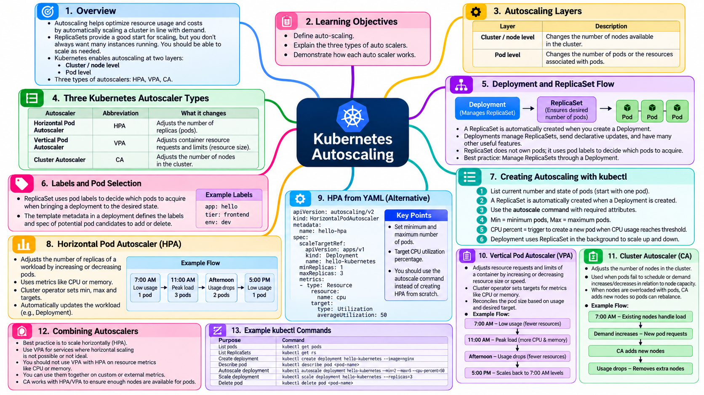
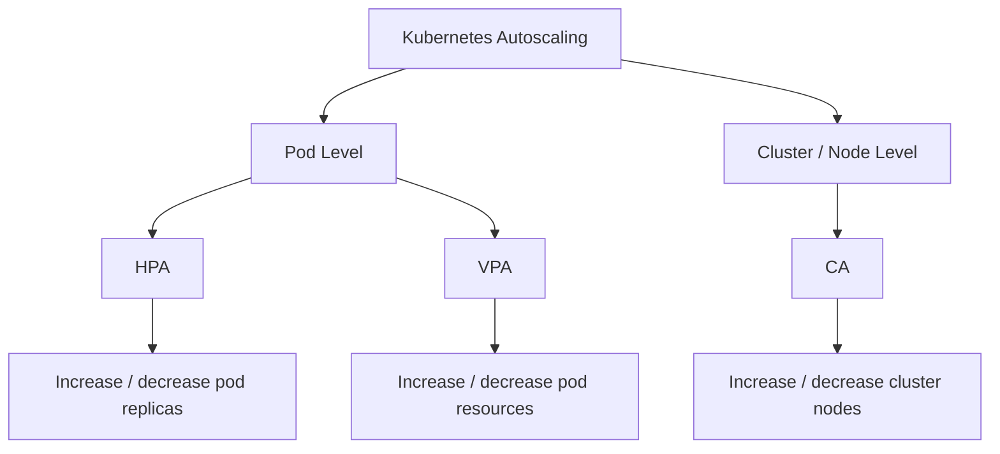
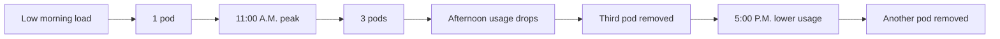
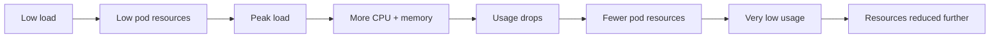
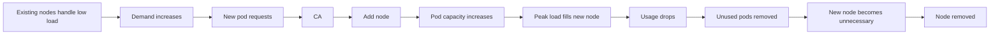

# Autoscaling

<figure><figcaption></figcaption></figure>

## Kubernetes Autoscaling — Comprehensive Study Notes

> **Source basis:** `Autoscaling.txt`, `Autoscaling-subtitles-en.vtt`, and the provided `Autoscaling.mp4`.
>
> **Completeness:** The TXT and VTT transcripts were checked after whitespace normalization and match exactly. The document below preserves the complete spoken content and adds only source-observed visual material from the video (commands, YAML, terminal output, and slide text/diagrams). No outside research has been added.

### Overview

This lesson introduces Kubernetes autoscaling and explains the three autoscaler types presented in the video:

* **Horizontal Pod Autoscaler (HPA):** changes the number of application pod replicas.
* **Vertical Pod Autoscaler (VPA):** changes the resource size/speed associated with a pod by adjusting resource requests and limits.
* **Cluster Autoscaler (CA):** changes the number of nodes available in the cluster.

The lesson presents autoscaling at two layers — **cluster/node level** and **pod level** — and demonstrates an autoscaling workflow using a Deployment/ReplicaSet, followed by HPA, VPA, and CA scenarios. It also states that combinations of the three types can be used together in appropriate scenarios.

### Table of Contents

1. [Learning Objectives](autoscaling.md#learning-objectives)
2. [Introduction to Autoscaling](autoscaling.md#introduction-to-autoscaling)
3. [Creating Autoscaling with Kubectl](autoscaling.md#creating-autoscaling-with-kubectl)
4. [How the Deployment and ReplicaSet Work Together](autoscaling.md#how-the-deployment-and-replicaset-work-together)
5. [Three Kubernetes Autoscaler Types](autoscaling.md#three-kubernetes-autoscaler-types)
6. [Horizontal Pod Autoscaler (HPA)](autoscaling.md#horizontal-pod-autoscaler-hpa)
7. [HPA from a YAML File](autoscaling.md#hpa-from-a-yaml-file)
8. [Vertical Pod Autoscaler (VPA)](autoscaling.md#vertical-pod-autoscaler-vpa)
9. [Cluster Autoscaler (CA)](autoscaling.md#cluster-autoscaler-ca)
10. [Choosing and Combining Autoscalers](autoscaling.md#choosing-and-combining-autoscalers)
11. [Recap](autoscaling.md#recap)
12. [Key Terms / Glossary](autoscaling.md#key-terms--glossary)
13. [Command Reference](autoscaling.md#command-reference)
14. [Video-Observed YAML](autoscaling.md#video-observed-yaml)
15. [Source Transcript — Complete](autoscaling.md#source-transcript--complete)
16. [Source Notes and Fidelity Notes](autoscaling.md#source-notes-and-fidelity-notes)

***

### Learning Objectives

After watching the video, the learner will be able to:

1. **Define auto-scaling.**
2. **Explain the three types of auto scalers.**
3. **Demonstrate how each auto scaler works.**

***

### Introduction to Autoscaling

Replica sets provide a good start for scaling, but you do not always want ten instances of your resource running. You should be able to **scale as needed**.

Kubernetes auto-scaling helps optimize **resource usage and costs** by automatically scaling a cluster in line with demand.

#### Autoscaling Layers

Kubernetes enables auto-scaling at two different layers:

| Layer                    | Meaning presented in the lesson                                               |
| ------------------------ | ----------------------------------------------------------------------------- |
| **Cluster / node level** | Autoscaling changes the number of nodes available in the cluster.             |
| **Pod level**            | Autoscaling changes the number of pods or the resources associated with pods. |

#### Three Autoscaler Types

The video identifies three types of autoscalers in Kubernetes:

| Autoscaler                    | Abbreviation | What it changes                                                                    |
| ----------------------------- | ------------ | ---------------------------------------------------------------------------------- |
| **Horizontal Pod Autoscaler** | HPA          | Adjusts the number of replicas / pods.                                             |
| **Vertical Pod Autoscaler**   | VPA          | Adjusts container resource requests and limits by changing resource size or speed. |
| **Cluster Autoscaler**        | CA           | Adjusts the number of nodes in the cluster.                                        |

#### Autoscaling Concept Map



***

### Creating Autoscaling with Kubectl

The lesson demonstrates the following sequence:

1. List the current number and state of pods.
2. Start from a scenario containing one pod.
3. A ReplicaSet is automatically created when a Deployment is created.
4. Use the `autoscale` command with the required attributes.
5. Define:
   * **Min** = minimum number of pods.
   * **Max** = maximum number of pods.
   * **CPU percent** = trigger for creating another pod when CPU usage reaches the configured threshold.
6. The Deployment continues to use its ReplicaSet in the background to scale up and down.
7. In the demonstrated scenario, the ReplicaSet replica count changes to **two** because the minimum value was changed to two.

#### Video-observed Kubectl workflow

The video visibly shows the command:

```bash
kubectl get pods
```

The video then shows:

```bash
kubectl get rs
```

The autoscaling command shown on screen is:

```bash
kubectl autoscale deploy hello-kubernetes --min=2 --max=5 --cpu-percent=50
```

The command output shown in the video is:

```
horizontalpodautoscaler.autoscaling/hello-kubernetes autoscaled
```

> **Video observation:** The command uses `--min=2`, `--max=5`, and `--cpu-percent=50`.

***

### How the Deployment and ReplicaSet Work Together

The lesson explicitly states that a ReplicaSet is automatically created when you create a Deployment.

During autoscaling:

```
Deployment
    |
    v
ReplicaSet
    |
    +---- Pod
    +---- Pod
    +---- ...
```

The Deployment still uses the ReplicaSet to scale up and down.

The video also visibly demonstrates the ReplicaSet state with a command similar to:

```bash
kubectl describe rs hello-kubernetes-5655b546f8
```

The video screenshot shows information including:

* **Controlled By:** `Deployment/hello-kubernetes`
* **Replicas:** `2 current / 2 desired`
* **Pods Status:** `2 Running / 0 Waiting / 0 Succeeded / 0 Failed`

The related pod listing visibly contains two running pods in that captured state.

***

### Three Kubernetes Autoscaler Types

The video explicitly defines three autoscaling types.

#### 1. Horizontal Pod Autoscaler (HPA)

The HPA adjusts the number of replicas of an application by **increasing or decreasing the number of pods**.

#### 2. Vertical Pod Autoscaler (VPA)

The VPA adjusts the **resource requests and limits of a container** by increasing or decreasing the resource size or speed of the pods.

#### 3. Cluster Autoscaler (CA)

The CA adjusts the **number of nodes in the cluster** when:

* pods fail to schedule, or
* demand increases or decreases in relation to the capacity of the nodes.

#### Comparison Table

| Autoscaler | Scaling direction / layer | Main quantity adjusted            | Source description                                                     |
| ---------- | ------------------------- | --------------------------------- | ---------------------------------------------------------------------- |
| **HPA**    | Horizontal / pod level    | Number of running pods / replicas | Increases or decreases pod count as application usage changes.         |
| **VPA**    | Vertical / pod level      | Pod resource requests and limits  | Adds or removes CPU and memory resources associated with pods.         |
| **CA**     | Cluster / node level      | Number of available nodes         | Adds or removes nodes based on pod scheduling needs and node capacity. |

***

## Horizontal Pod Autoscaler (HPA)

In Kubernetes, an HPA automatically updates a workload resource such as a Deployment by **horizontally scaling the workload to match demand**.

#### Horizontal Scaling / Scaling Out

Horizontal scaling, or **scaling out**, automatically increases or decreases the number of running pods as application usage changes.

An HPA uses a cluster operator that sets targets for metrics such as:

* CPU utilization
* Memory utilization
* Maximum desired number of replicas
* Minimum desired number of replicas

#### HPA Lifecycle Example

The lesson uses a time-of-day example.

**Early morning**

System load is low, so **one pod is sufficient**.

The HPA auto-scales the workload resource to meet usage demands.

**11:00 A.M. peak**

Peak load drives a need for **three pods**.

The HPA auto-scales the workload resource to meet the usage demand.

**Afternoon**

Usage drops.

The **third pod is marked for deletion and removed**.

**5:00 P.M.**

Usage drops even lower.

Another pod is **marked for deletion and removed**.

#### HPA Behavior Diagram



#### Video-observed HPA output

The video shows an HPA listing using:

```bash
kubectl get hpa
```

The captured table includes fields such as:

| Field shown   | Captured visual content       |
| ------------- | ----------------------------- |
| **NAME**      | `hello-kubernetes`            |
| **REFERENCE** | `Deployment/hello-kubernetes` |
| **TARGETS**   | `<unknown>/10%`               |
| **MINPODS**   | `1`                           |
| **MAXPODS**   | `5`                           |
| **REPLICAS**  | `2`                           |
| **AGE**       | `10m`                         |

> **Important source-fidelity note:** The earlier autoscaling command shown in the video uses `--min=2` and `--cpu-percent=50`, while this later captured HPA table shows `MINPODS 1`, `MAXPODS 5`, `REPLICAS 2`, and a `10%` target. These are reproduced as separate observed states from the source; no attempt is made here to silently reconcile the difference.

***

### HPA from a YAML File

Another way to enable auto-scaling is to manually create the HPA object in a YAML file.

<div align="left"><figure><figcaption></figcaption></figure></div>

Similar to the `autoscale` command, you can set:

* minimum number of pods
* maximum number of pods

The video states that the CPU percent flag appears as:

> **target CPU utilization percentage**

The lesson also states that although an HPA autoscaler can be created from scratch, the **`autoscale` command should be used instead**.

***

### Vertical Pod Autoscaler (VPA)

The lesson says that a best practice is to scale horizontally, but some services may need to run in a cluster where horizontal scaling is **impossible or not ideal**.

#### Vertical Scaling / Scaling Up

Vertical scaling, or **scaling up**, refers to:

> adding more resources to an existing machine.

A VPA lets you scale a service **vertically within a cluster**.

The cluster operator sets targets for metrics such as:

* CPU utilization
* memory utilization

This is similar to an HPA.

The cluster then **reconciles the size of the service's pod or pods** based on:

* current usage
* desired target

#### VPA Example

The lesson again uses a time-of-day scenario.

**Early morning**

System load is low, so the system resources used by the pod are low.

**11:00 A.M. peak**

Peak load drives a need for more capacity.

The VPA auto-scales the pod by adding more system resources:

* CPU
* memory

This is done to meet demand.

**Afternoon**

Usage drops.

The pod is auto-scaled to use fewer system resources.

**5:00 P.M.**

Usage drops even lower.

The pod is auto-scaled further to match the **7:00 A.M. levels**.

#### VPA Resource Behavior



#### VPA and HPA Together

The lesson states:

> You should not use VPAs with HPAs on resource metrics like CPU or memory.

However:

> You can use them together on custom or external metrics.

This distinction is explicitly part of the lesson.

***

## Cluster Autoscaler (CA)

A CA auto-scales the **cluster itself**, increasing or decreasing the number of available nodes that pods can run on.

Pods are auto-scaled using **HPA or VPA**.

However, when the nodes themselves are overloaded with pods, you can use a CA to auto-scale the nodes so that the pods can **rebalance themselves across the cluster**.

#### CA Example

**Early morning**

System load is low.

Existing nodes can handle the load.

**Demand increases**

New pod requests come in.

The CA auto-scales the cluster by adding:

* a new node
* a pod

to meet the demand.

**11:00 A.M. peak**

Peak load brings the new node to **full capacity**.

**Afternoon**

Usage drops.

Unused pods are marked for deletion and removed.

**5:00 P.M.**

Usage drops even lower.

All pods in the new node are marked for deletion and removed.

Then the **node itself is marked and removed**.

#### Cluster Autoscaler Concept



#### Why the Lesson Uses CA

A Cluster Autoscaler ensures there is always enough **computer power** to run tasks while avoiding paying extra for unused nodes.

The lesson gives examples of periods when capacity may not need to remain high:

* Nights
* Weekends
* Pure development loads
* Continuous integration testing loads
* Periods when all batch processing jobs are complete
* Periods before the next batch starts later in the day

***

## Choosing and Combining Autoscalers

The lesson states that each autoscaler type is suitable in specific scenarios.

It says that you should analyze the **pros and cons of each** to find the best choice.

The lesson also states that using a **combination of all three types** can ensure that services run stably during peak load times while costs are minimized during lower demand.

#### Layered View

```
                    Kubernetes Autoscaling
                           |
          +----------------+----------------+
          |                                 |
     Pod level                       Cluster / Node level
          |                                 |
     +----+----+                         +--+--+
     |         |                         |     |
    HPA       VPA                       CA     |
     |         |                         |     |
  Pod count  Pod resources         Node count
```

***

## Recap

The video's recap states:

* **Autoscaling enables scaling as needed at the cluster or node level and the pod level.**
* **You can autoscale a Deployment or a ReplicaSet.**
* Autoscaler types include:
  * Horizontal Pod Autoscaler (HPA)
  * Vertical Pod Autoscaler (VPA)
  * Cluster Autoscaler (CA)
* A combination of all three autoscaler types often provides the most optimized solution.

***

## Key Terms / Glossary

| Term                                                | Meaning from the lesson                                                                                                                |
| --------------------------------------------------- | -------------------------------------------------------------------------------------------------------------------------------------- |
| **Autoscaling / Auto-scaling**                      | Scaling resources automatically in line with demand.                                                                                   |
| **Autoscaler**                                      | A mechanism that changes pod, pod-resource, or node capacity according to demand and configured targets.                               |
| **HPA**                                             | Horizontal Pod Autoscaler; changes the number of application replicas/pods.                                                            |
| **VPA**                                             | Vertical Pod Autoscaler; changes pod resource requests/limits and resource size/speed.                                                 |
| **CA**                                              | Cluster Autoscaler; changes the number of available cluster nodes.                                                                     |
| **Horizontal scaling / scaling out**                | Increasing or decreasing the number of running pods.                                                                                   |
| **Vertical scaling / scaling up**                   | Adding more resources to an existing machine/service.                                                                                  |
| **Deployment**                                      | A workload resource referenced by the HPA example; the lesson says a ReplicaSet is automatically created when a Deployment is created. |
| **ReplicaSet**                                      | The object used in the background by the Deployment to scale up/down the pods.                                                         |
| **Replica**                                         | An instance represented by a desired application pod count.                                                                            |
| **Minimum pods**                                    | The minimum number of pods configured for autoscaling.                                                                                 |
| **Maximum pods**                                    | The maximum number of pods configured for autoscaling.                                                                                 |
| **CPU percent / target CPU utilization percentage** | The CPU-based trigger/target described for HPA autoscaling.                                                                            |
| **Resource requests and limits**                    | Container resource settings that the VPA adjusts.                                                                                      |
| **Node**                                            | Cluster capacity on which pods can run.                                                                                                |
| **Custom metrics**                                  | Metrics for which the lesson says HPA and VPA can be used together.                                                                    |
| **External metrics**                                | External metrics for which the lesson says HPA and VPA can be used together.                                                           |
| **Peak load**                                       | A period of increased demand that causes additional capacity to be required.                                                           |
| **Reconcile**                                       | In the lesson's wording, the cluster adjusts the pod size based on current usage and the desired target.                               |

***

## Command Reference

The following commands are directly visible in the provided video.

| Command                        | Purpose                                                                        | Syntax / Example                                                             | Notes                                                                   |
| ------------------------------ | ------------------------------------------------------------------------------ | ---------------------------------------------------------------------------- | ----------------------------------------------------------------------- |
| `kubectl get pods`             | List pods and inspect current pod state.                                       | `kubectl get pods`                                                           | Used at the beginning of the autoscaling walkthrough.                   |
| `kubectl get rs`               | List ReplicaSets.                                                              | `kubectl get rs`                                                             | Used to inspect the ReplicaSet associated with the Deployment.          |
| `kubectl autoscale deploy ...` | Create autoscaling for a Deployment.                                           | `kubectl autoscale deploy hello-kubernetes --min=2 --max=5 --cpu-percent=50` | Video example uses min 2, max 5, CPU 50%.                               |
| `kubectl describe rs ...`      | Describe the ReplicaSet and inspect controller/replica/pod status information. | `kubectl describe rs hello-kubernetes-5655b546f8`                            | Exact captured ReplicaSet name is reproduced from the video screenshot. |
| `kubectl get hpa`              | Display HPA status and scaling values.                                         | `kubectl get hpa`                                                            | Video screenshot shows target, min pods, max pods, replicas, and age.   |

#### Command Output Observed in the Video

After the autoscale command, the video shows:

```
horizontalpodautoscaler.autoscaling/hello-kubernetes autoscaled
```

The `kubectl describe rs ...` screenshot shows:

```
Controlled By     Deployment/hello-kubernetes
Replicas          2 current / 2 desired
Pods Status       2 Running / 0 Waiting / 0 Succeeded / 0 Failed
```

***

## Video-Observed YAML

The video includes a slide titled **“Autoscaling with HPA from scratch”** and displays the following YAML:

```yaml
apiVersion: autoscaling/v1
kind: HorizontalPodAutoscaler
metadata:
  name: hello-kubernetes
  namespace: default
spec:
  maxReplicas: 5
  minReplicas: 2
  scaleTargetRef:
    apiVersion: apps/v1
    kind: Deployment
    name: hello-kubernetes
  targetCPUUtilizationPercentage: 10
```

#### YAML Elements Shown

| YAML element                          | Value shown in video      |
| ------------------------------------- | ------------------------- |
| `apiVersion`                          | `autoscaling/v1`          |
| `kind`                                | `HorizontalPodAutoscaler` |
| `metadata.name`                       | `hello-kubernetes`        |
| `metadata.namespace`                  | `default`                 |
| `spec.maxReplicas`                    | `5`                       |
| `spec.minReplicas`                    | `2`                       |
| `spec.scaleTargetRef.apiVersion`      | `apps/v1`                 |
| `spec.scaleTargetRef.kind`            | `Deployment`              |
| `spec.scaleTargetRef.name`            | `hello-kubernetes`        |
| `spec.targetCPUUtilizationPercentage` | `10`                      |

> **Source-fidelity note:** The YAML slide visibly shows `targetCPUUtilizationPercentage: 10`, while the earlier CLI example visibly shows `--cpu-percent=50`. Both values are retained exactly as shown in their respective source locations.

***

## Source Transcript — Complete

The following is the complete spoken transcript, reflowed for readability while preserving the source wording and all concepts. The TXT and VTT transcripts were verified to match after whitespace normalization.

#### Part 1 — Introduction and Initial Autoscaling Walkthrough

Hello, and welcome to auto-scaling. After watching this video, you will be able to define auto-scaling. Explain the three types of auto scalers, and demonstrate how each auto scaler works. Replica sets provide a good start for scaling, but you don't always want ten instances of your resource running. You should be able to scale as needed. Kubernetes auto-scaling helps optimize resource usage and costs by automatically scaling a cluster in line with demand. Kubernetes enables auto-scaling at two different layers, the cluster or node level and the pod level. Three types of auto scalars are available in Kubernetes, horizontal pod auto scalar or HPA, vertical pod auto scalar or VPA, and cluster auto scalar or CA.

#### Part 2 — Creating Autoscaling and ReplicaSet Behavior

To create auto-scaling, list the current number and state of pods. You have one pod in this scenario. A replica set is automatically created when you create a deployment. In order to auto-scale, you simply use the autoscale command with the requisite attributes. Min is the number of minimum pods. Notice that we have changed the value of min to two. Max is the number of maximum pods, and CPU percent acts as a trigger that tells the system to create a new pod when the CPU usage reaches 50% across the cluster. In the background, the deployment still uses the replica set to scale up and down. Notice the numbers of replicas in this auto-scaled replica set has changed to two since the minimum number specified in the previous autoscale command was changed to two.

#### Part 3 — The Three Autoscaler Types

Now, in Kubernetes, there are three autoscaling types. The horizontal pod auto scalar or HPA adjusts the number of replicas of an application by increasing or decreasing the number of pods. The vertical pod auto scalar or VPA adjusts the resource requests and limits of a container by increasing or decreasing the resource size or speed of the pods. The cluster auto scaler or CA adjusts the number of nodes in the cluster when pods fail to schedule or demand increases or decreases in relation to the nodes capacity.

#### Part 4 — Horizontal Pod Autoscaler (HPA)

In Kubernetes, an HPA automatically updates a workload resource like a deployment by horizontally scaling the workload to match the demand. Horizontal scaling or scaling out automatically increases or decreases the number of running pods as application usage changes. An HPA uses a cluster operator that sets targets for metrics like CPU or memory utilization and the maximum and minimum desired number of replicas. For example, the system load is low early in the morning, so one pod is sufficient. The HPA auto-scales the workload resource to meet usage demands. By 11:00 A.M. Peak load drives a need for three pods. The HPA auto-scales the workload resource to meet usage demand. Usage drops in the afternoon, so the third pod is marked for deletion and removed, and usage drops even lower by 5:00 P.M. Another pod is marked for deletion and removed. Another way to enable auto-scaling is to manually create the HPA object for a YAML file. Similar to the autoscale command, you can set the minimum and maximum number of pods. The CPU percent flag shows up as, target CPU utilization percentage, and even though you can create an HPA autoscaler from scratch, you should use the autoscale command instead. A best practice is to scale horizontally, but there are some services you may want to run in a cluster, where horizontal scaling is impossible or not ideal.

#### Part 5 — Vertical Pod Autoscaler (VPA)

Vertical scaling or scaling up refers to adding more resources to an existing machine. A VPA lets you scale a service vertically within a cluster. The cluster operator sets targets for metrics like CPU or memory utilization, similar to an HPA. The cluster then reconciles the size of the services pod or pods based on their current usage and the desired target. For example, the system load is low early in the morning, so system resources used by the pod are low. By 11:00 A.M. Peak load drives a need for more capacity. The VPA auto-scales the pod by adding more system resources, CPU, and memory to meet the demand. Usage drops in the afternoon. The pod is auto-scaled to use fewer system resources, and usage drops even lower by 5:00 P.M. The pod is auto-scaled further to match the 7:00 A.M. Levels. You should not use VPAs with HPAs on resource metrics like CPU or memory. However, you can use them together on custom or external metrics.

#### Part 6 — Cluster Autoscaler (CA)

A CA auto-scales the cluster itself, increasing or decreasing the number of available nodes that pods can run on. Pods are auto-scaled using HPA or VPA. But when the nodes themselves are overloaded with pods, you can use a CA to auto-scale the nodes so that the pods can rebalance themselves across the cluster. For example, the system load is low early in the morning, so existing nodes can handle the load. When demand increases, new pod requests come in, and the CA auto-scales the cluster by adding a new node and pod to meet the demand. By 11:00 A.M. Peak load brings the new node to full capacity. When usage drops in the afternoon, unused pods are marked for deletion and removed. When usage drops even lower by 5:00 P.M. All pods in the new node are marked for deletion and removed. Then the node itself is marked and removed. A cluster auto scaler ensures there is always enough computer power to run your tasks, and that you aren't paying extra for unused nodes. For example, nights and weekends may have pure development or continuous integration testing loads, and clusters may have periods where all batch processing jobs are complete, and the new batch doesn't start until later in the day.

#### Part 7 — Selection, Combination, and Final Recap

Each autoscaler type is suitable in specific scenarios. You should analyze the pros and cons of each to find the best choice. Using a combination of all three types ensures that services run stabely at peak load times, and costs are minimized in times of lower demand. In this video, you'll learn that. Auto-scaling enables scaling as needed at the cluster or node level and the pod level. You can auto-scale a deployment or a replica set. Autoscaler types include horizontal pod or HPA, vertical pod, or VPA, and cluster or CA, and a combination of all three autoscaler types often provides the most optimized solution. A

***

## Source Notes and Fidelity Notes

### Source files inspected

| Source                         | Purpose                                                                      |
| ------------------------------ | ---------------------------------------------------------------------------- |
| `Autoscaling.txt`              | Full transcript text.                                                        |
| `Autoscaling-subtitles-en.vtt` | Timestamped subtitle transcript.                                             |
| `Autoscaling.mp4`              | Video used to inspect slides, code, commands, terminal output, and diagrams. |

### Transcript validation

* TXT transcript length: **6,140 characters** after reading the supplied file.
* VTT cue count: **156 cues**.
* VTT spoken-text length: **6,140 characters**.
* TXT and VTT spoken text: **exact match after whitespace normalization**.
* Subtitle timing starts at approximately **00:00:06.470**.
* Final subtitle cue ends at approximately **00:07:02.770**.
* The provided video duration is approximately **7:04.9**.

### Terminology fidelity

The source transcript uses wording such as:

* “auto scaler”
* “auto-scaling”
* “horizontal pod auto scalar”
* “vertical pod auto scalar”
* “cluster auto scalar”
* “stabely”

This document uses standard-looking headings such as **Autoscaler**, **HPA**, **VPA**, and **CA** for professional organization, while retaining the complete source transcript below. The source wording is not silently omitted.

### Video-only details added to the organized notes

The video visibly supplies information that is not fully represented in the plain TXT transcript, including:

* `kubectl get pods`
* `kubectl get rs`
* `kubectl autoscale deploy hello-kubernetes --min=2 --max=5 --cpu-percent=50`
* `kubectl describe rs hello-kubernetes-5655b546f8`
* `kubectl get hpa`
* Command output showing HPA creation.
* ReplicaSet status showing `2 current / 2 desired`.
* HPA screen showing a `10%` CPU target in a later captured state.
* HPA-from-scratch YAML.
* HPA graph showing pod count varying with load.
* VPA resource graph/illustration.
* CA node-count graph and a diagram showing pods distributed across existing nodes and a newly added node.
* A recap slide stating that autoscaling can apply to a Deployment or ReplicaSet and can operate at pod and cluster/node levels.

### No external technical corrections

This document intentionally does **not** replace source statements with outside Kubernetes documentation. Where the provided video and transcript present different captured values or states, both are retained and explicitly identified rather than silently reconciled.
