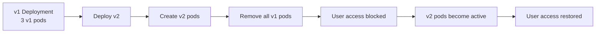
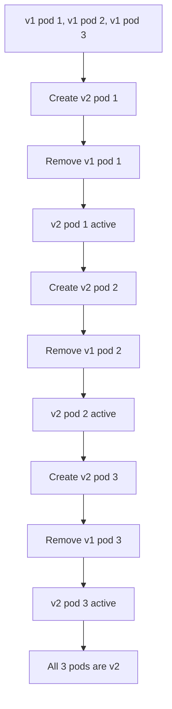
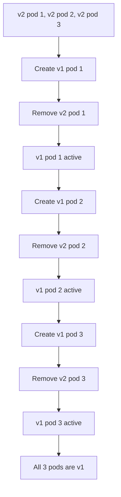
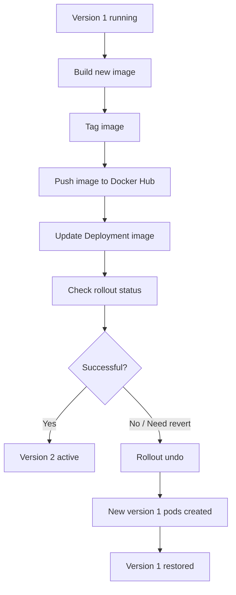

# Rolling Updates

<figure><figcaption></figcaption></figure>

## Kubernetes Rolling Updates — Comprehensive Technical Notes

> **Source files:** `rolling_updates.txt`, `rolling_updates-subtitles-en.vtt`, and `rolling_updates.mp4`
>
> **Source fidelity:** The TXT and VTT spoken content was checked after whitespace normalization and matched exactly. The organized notes below preserve all source concepts and wording through the complete transcript appendix. Additional command examples are explicitly labeled as **Live example** or **Added live example** and are provided only where the source describes a partial/generic command or workflow.
>
> **Video analysis:** The supplied MP4 was inspected for slides, YAML, commands, terminal output, configuration examples, and rollout/rollback diagrams.

### Visual Mind Map

> **Image note:** The image above is a generated visual study aid based on the content of the supplied lesson.

***

### Overview

Rolling updates are presented in the lesson as automated updates that occur on a scheduled basis. They roll out automated and controlled application changes across pods, work with pod templates such as Deployments, and allow rollback when needed.

The lesson covers:

* What a rolling update is and how it works.
* The pre-steps required before a rolling update can be applied.
* How to configure a rolling-update strategy.
* How to update an application's container image.
* How to verify rollout status.
* How to roll back a deployment.
* All-at-once rollout.
* All-at-once rollback.
* One-at-a-time rollout.
* One-at-a-time rollback.
* Zero-downtime behavior.

***

### Table of Contents

1. [Learning Objectives](rolling-updates.md#learning-objectives)
2. [What Is a Rolling Update?](rolling-updates.md#what-is-a-rolling-update)
3. [Pre-Steps Before Applying a Rolling Update](rolling-updates.md#pre-steps-before-applying-a-rolling-update)
4. [Rolling Update Strategy Parameters](rolling-updates.md#rolling-update-strategy-parameters)
5. [Working Example: Updating an Application](rolling-updates.md#working-example-updating-an-application)
6. [Building, Tagging, and Pushing the New Image](rolling-updates.md#building-tagging-and-pushing-the-new-image)
7. [Applying the New Image to the Deployment](rolling-updates.md#applying-the-new-image-to-the-deployment)
8. [Verifying the Rollout](rolling-updates.md#verifying-the-rollout)
9. [Rolling Back to Version 1](rolling-updates.md#rolling-back-to-version-1)
10. [How Rolling Updates Work](rolling-updates.md#how-rolling-updates-work)
11. [Scenario 1 — All-at-Once Rollout](rolling-updates.md#scenario-1--all-at-once-rollout)
12. [Scenario 2 — All-at-Once Rollback](rolling-updates.md#scenario-2--all-at-once-rollback)
13. [Scenario 3 — One-at-a-Time Rollout](rolling-updates.md#scenario-3--one-at-a-time-rollout)
14. [Scenario 4 — One-at-a-Time Rollback](rolling-updates.md#scenario-4--one-at-a-time-rollback)
15. [Strategy Comparison](rolling-updates.md#strategy-comparison)
16. [Command Reference](rolling-updates.md#command-reference)
17. [Configuration Reference](rolling-updates.md#configuration-reference)
18. [Key Terms / Glossary](rolling-updates.md#key-terms--glossary)
19. [Complete Timestamped Transcript](rolling-updates.md#complete-timestamped-transcript)
20. [Source and Fidelity Notes](rolling-updates.md#source-and-fidelity-notes)

***

## Learning Objectives

After watching the video, you will be able to:

1. **Explain what a rolling update is and how it works.**
2. **List the pre-steps before a rolling update can be applied.**
3. **Demonstrate how to roll back a rolling update.**

***

## What Is a Rolling Update?

Rolling updates are automated updates that occur on a scheduled basis.

They:

* Roll out automated and controlled application changes across pods.
* Work with pod templates like Deployments.
* Allow for rollback as needed.

#### Core Idea

```
Application update
       |
       v
Controlled rollout across pods
       |
       +--> New version becomes active
       |
       +--> Old version is replaced
       |
       +--> Rollback is possible when needed
```

The lesson emphasizes that a rolling update is intended to make application changes in a **controlled and automated way**.

***

## Pre-Steps Before Applying a Rolling Update

The lesson identifies two preparation steps.

### Step 1 — Add Liveness and Readiness Probes

Add:

* **Liveness probes**
* **Readiness probes**

to deployments.

The stated reason is that deployments are then appropriately marked as ready.

#### Video-observed probe configuration

The video displays the following probe configuration:

```yaml
livenessProbe:
  httpGet:
    path: /
    port: 9000
  initialDelaySeconds: 300
  periodSeconds: 15

readinessProbe:
  httpGet:
    path: /
    port: 9000
  initialDelaySeconds: 45
  periodSeconds: 5
```

#### Probe parameters observed

| Probe     | Parameter             | Value shown |
| --------- | --------------------- | ----------: |
| Liveness  | `httpGet.path`        |         `/` |
| Liveness  | `httpGet.port`        |      `9000` |
| Liveness  | `initialDelaySeconds` |       `300` |
| Liveness  | `periodSeconds`       |        `15` |
| Readiness | `httpGet.path`        |         `/` |
| Readiness | `httpGet.port`        |      `9000` |
| Readiness | `initialDelaySeconds` |        `45` |
| Readiness | `periodSeconds`       |         `5` |

***

### Step 2 — Add a Rolling Update Strategy to the YAML File

The lesson says to add a rolling update strategy to the YAML file.

The video shows a Deployment configured approximately as follows:

```yaml
apiVersion: apps/v1
kind: Deployment
metadata:
  name: nginx-test
spec:
  replicas: 10
  selector:
    matchLabels:
      service: http-server
  minReadySeconds: 5
  progressDeadlineSeconds: 600
  strategy:
    type: RollingUpdate
    rollingUpdate:
      maxUnavailable: 50%
      maxSurge: 2
```

> **Source fidelity note:** The transcript says “miniReadySeconds,” while the video visibly shows the YAML field `minReadySeconds: 5`. Both source forms are retained in the notes rather than silently changing the transcript.

***

## Rolling Update Strategy Parameters

The lesson's example uses **10 pods**.

The strategy is:

* At least **50% of the pods** should always be available.
* `maxSurge: 2` means the lesson's example allows 2 additional pods above the 10 defined earlier.
* `maxUnavailable: 0` is recommended in the lesson for a zero-downtime system.
* `maxSurge: 100%` would double the number of pods and create a complete replica before taking the original set down after the rollout is complete.
* `minReadySeconds` can be useful when you want to wait a few seconds before moving to the next pod in the rollout stage.

#### Parameter Reference

| Parameter                 | Source meaning                                                                                                                             |
| ------------------------- | ------------------------------------------------------------------------------------------------------------------------------------------ |
| `replicas`                | Number of pods in the example; the lesson uses `10`.                                                                                       |
| `strategy.type`           | Set to `RollingUpdate`.                                                                                                                    |
| `maxUnavailable`          | Controls how many pods may be unavailable during the rollout. The example uses `50%`; the lesson says `0` supports a zero-downtime system. |
| `maxSurge`                | Controls additional pods during the rollout. Example: `2`; the lesson also discusses `100%`.                                               |
| `minReadySeconds`         | Can be used to wait a few seconds before moving to the next pod in the rollout stage.                                                      |
| `progressDeadlineSeconds` | Video configuration shows `600`.                                                                                                           |

#### Strategy Example With Zero-Downtime Setting

The lesson explicitly states that for a zero-downtime system:

```yaml
rollingUpdate:
  maxUnavailable: 0
```

#### 100% Surge Setting

The lesson states that:

```yaml
rollingUpdate:
  maxSurge: 100%
```

would double the number of pods and create a complete replica before the original set is taken down after the rollout is complete.

***

## Working Example: Updating an Application

The lesson then demonstrates a working rollout scenario.

#### Starting State

* Deployment has **3 pods** in its ReplicaSet.
* The application displays:

```
Hello World!
```

#### Requested Change

A client submits a new request.

A new image is available with a different message.

Instead of the original text, users should see:

```
Hello World v2
```

#### Availability Requirement

The lesson states:

> You cannot have any downtime in the application.

***

## Building, Tagging, and Pushing the New Image

Before updating Kubernetes, the lesson says to:

1. Build the new image.
2. Tag the image.
3. Upload the image to Docker Hub.

The video explicitly shows these Docker commands.

### Docker Image Workflow

| Purpose     | Source command                                           |
| ----------- | -------------------------------------------------------- |
| Build image | `docker build -t hello-kubernetes .`                     |
| Tag image   | `docker tag hello-kubernetes upkar/hello-kubernetes:2.0` |
| Push image  | `docker push upkar/hello-kubernetes:2.0`                 |

#### 1. Build the image

```bash
docker build -t hello-kubernetes .
```

#### 2. Tag the image

```bash
docker tag hello-kubernetes upkar/hello-kubernetes:2.0
```

#### 3. Push the image

```bash
docker push upkar/hello-kubernetes:2.0
```

The video explains that these are **simple Docker commands** and are **not related to Kubernetes**.

#### Source Image Naming

The transcript expresses the updated image name and tag as:

`hello-kubernetes-upcar-hello-kubernetes-colon-2.0`

The video screenshot shows the concrete repository/tag:

```
upkar/hello-kubernetes:2.0
```

***

## Applying the New Image to the Deployment

The video first checks the existing deployment:

```bash
kubectl get deployments
```

The captured deployment output shows:

```
NAME               READY   UP-TO-DATE   AVAILABLE   AGE
hello-kubernetes   3/3     3            3           21m
```

Next, the video updates the image:

```bash
kubectl set image deployments/hello-kubernetes hello-kubernetes=upkar/hello-kubernetes:2.0
```

The output shown is:

```
deployment.extensions/hello-kubernetes image updated
```

#### Live example

The command above is already complete in the video. A direct live example using the same resource names is:

```bash
kubectl set image deployment/hello-kubernetes hello-kubernetes=upkar/hello-kubernetes:2.0
```

> **Live example note:** This is the same update operation, written with the singular resource form `deployment/...`.

***

## Verifying the Rollout

The lesson says to verify the rollout using the **rollout status** command.

The video shows:

```bash
kubectl rollout status deployment/hello-kubernetes
```

The API output shown in the lesson indicates:

```
deployment "hello-kubernetes" successfully rolled out
```

#### Partial / generic command from the narration

The transcript refers to the generic phrase **“rollout status command.”**

#### Live example

```bash
kubectl rollout status deployment/hello-kubernetes
```

After the successful rollout, the lesson says that going back to the URL displays:

```
Hello World v2
```

***

## Rolling Back to Version 1

The lesson states that rollbacks are easy to implement in Kubernetes.

Situations mentioned include:

* Errors in a deployment.
* A client changing their mind.

The lesson instructs you to use an **undo command on the rollout**.

The video shows:

```bash
kubectl rollout undo deployments/hello-kubernetes
```

The output shown is:

```
deployment.extensions/hello-kubernetes rolled back
```

#### Partial / generic command from the narration

The transcript says:

> Use an undo command on the rollout.

#### Live example

```bash
kubectl rollout undo deployment/hello-kubernetes
```

After initiating the rollback, the lesson says to verify the pods:

```bash
kubectl get pods
```

The video shows the new rollout pods appearing as **Running** while the previous-version pods are **Terminating** during the rollback transition.

#### Rollback result

After the rollback:

* Three new pods are created as part of the rollback.
* The old message becomes visible again.

The application returns to:

```
Hello World!
```

***

## How Rolling Updates Work

The video then explains four rollout/rollback patterns:

| Scenario       | Direction              | Behavior                                                                              |
| -------------- | ---------------------- | ------------------------------------------------------------------------------------- |
| **Scenario 1** | All-at-once rollout    | Version 1 is removed before version 2 becomes active.                                 |
| **Scenario 2** | All-at-once rollback   | Version 2 is removed before version 1 becomes active.                                 |
| **Scenario 3** | One-at-a-time rollout  | Pods are updated in a staggered sequence so user access is not interrupted.           |
| **Scenario 4** | One-at-a-time rollback | Rollback is also performed in a staggered sequence so user access is not interrupted. |

***

## Scenario 1 — All-at-Once Rollout

In an all-at-once rollout:

> All v1 objects must be removed before v2 objects can become active.

#### Starting State

* Version 1 application.
* 3 v1 pods.
* Users can access the application.

#### Rollout Sequence

1. Version 2 is deployed.
2. New v2 pods are created.
3. Version 1 pods are marked for deletion.
4. Version 1 pods are removed.
5. **User access is blocked** during this transition.
6. Version 2 pods become active.
7. User access is restored.

The video asks you to notice the **time lag between deployment and pod updates**.

#### All-at-Once Rollout Diagram



***

## Scenario 2 — All-at-Once Rollback

In an all-at-once rollback:

> All v2 objects must be removed before v1 objects can become active.

#### Starting State

* Version 2 application.
* 3 v2 pods.
* Users can access the application.

#### Rollback Sequence

1. Version 1 of the app is deployed.
2. New v1 pods are created.
3. Version 2 pods are marked for deletion.
4. Version 2 pods are removed.
5. **User access is blocked**.
6. Version 1 pods become active.
7. User access is restored.

#### All-at-Once Rollback Diagram


***

## Scenario 3 — One-at-a-Time Rollout

In a one-at-a-time rollout:

> The update is staggered so user access is not interrupted.

#### Starting State

* Version 1 application.
* 3 running v1 pods.
* Users can access the application.

#### Step-by-Step

**Pod 1**

1. A new v2 pod is created.
2. The first v1 pod is marked for deletion and removed.
3. The v2 pod becomes active.

**Pod 2**

1. A second v2 pod is created.
2. The second v1 pod is marked for deletion and removed.
3. The second v2 pod becomes active.

**Pod 3**

1. A third v2 pod is created.
2. The third v1 pod is marked for deletion and removed.
3. The third v2 pod becomes active.

#### Result

The update is **staggered**, and user access is **not interrupted**.

#### One-at-a-Time Rollout Diagram



***

## Scenario 4 — One-at-a-Time Rollback

In a one-at-a-time rollback:

> The update rollback is staggered so user access is not interrupted.

#### Starting State

* Version 2 application.
* 3 running v2 pods.
* Users can access the application.

#### Step-by-Step

**Pod 1**

1. A new v1 pod is created.
2. The first v2 pod is marked for deletion and removed.
3. The v1 pod becomes active.

**Pod 2**

1. A second v1 pod is created.
2. The second v2 pod is marked for deletion and removed.
3. The second v1 pod becomes active.

**Pod 3**

1. A third v1 pod is created.
2. The third v2 pod is marked for deletion and removed.
3. The third v1 pod becomes active.

#### Result

The rollback is **staggered**, and user access is **not interrupted**.

#### One-at-a-Time Rollback Diagram



***

## Strategy Comparison

| Aspect                        | All-at-Once                                               | One-at-a-Time                                 |
| ----------------------------- | --------------------------------------------------------- | --------------------------------------------- |
| Rollout sequencing            | Old version is removed before new version becomes active. | Replacement is staggered pod by pod.          |
| User access during transition | Blocked according to the lesson.                          | Not interrupted according to the lesson.      |
| Rollback form                 | All v2 objects removed before v1 becomes active.          | v2 is replaced by v1 in a staggered sequence. |
| Pod transition                | Large transition                                          | Incremental transition                        |
| Lesson emphasis               | Time lag and temporary blocked access                     | Continuous user access                        |

***

## Command Reference

### Kubernetes Commands

| Purpose          | Source / Related command                                | Live example                                                                                |
| ---------------- | ------------------------------------------------------- | ------------------------------------------------------------------------------------------- |
| List deployments | `get deployments`                                       | `kubectl get deployments`                                                                   |
| Update an image  | `set image` / source shows deployment and image details | `kubectl set image deployment/hello-kubernetes hello-kubernetes=upkar/hello-kubernetes:2.0` |
| Check rollout    | `rollout status`                                        | `kubectl rollout status deployment/hello-kubernetes`                                        |
| Roll back        | `rollout undo`                                          | `kubectl rollout undo deployment/hello-kubernetes`                                          |
| Check pods       | `get pods`                                              | `kubectl get pods`                                                                          |

#### Exact commands shown in the video

```bash
kubectl get deployments
```

```bash
kubectl set image deployments/hello-kubernetes hello-kubernetes=upkar/hello-kubernetes:2.0
```

```bash
kubectl rollout status deployment/hello-kubernetes
```

```bash
kubectl rollout undo deployments/hello-kubernetes
```

```bash
kubectl get pods
```

### Docker Commands

```bash
docker build -t hello-kubernetes .
```

```bash
docker tag hello-kubernetes upkar/hello-kubernetes:2.0
```

```bash
docker push upkar/hello-kubernetes:2.0
```

> The lesson explicitly states that these Docker commands are not Kubernetes commands.

***

## Partial / Generic Commands → Live Examples

The lesson uses several command names generically in the narration without always stating the complete command.

### Rollout Status

**Source wording:** “use the rollout status command”

**Live example:**

```bash
kubectl rollout status deployment/hello-kubernetes
```

### Rollout Undo

**Source wording:** “Use an undo command on the rollout”

**Live example:**

```bash
kubectl rollout undo deployment/hello-kubernetes
```

### Get Pods

**Source wording:** “Use the get pods command”

**Live example:**

```bash
kubectl get pods
```

### Get Deployments

**Source wording / workflow:** check the deployment details

**Live example:**

```bash
kubectl get deployments
```

***

## Configuration Reference

### Rolling Update Deployment Configuration

The video-observed configuration is:

```yaml
apiVersion: apps/v1
kind: Deployment
metadata:
  name: nginx-test
spec:
  replicas: 10
  selector:
    matchLabels:
      service: http-server
  minReadySeconds: 5
  progressDeadlineSeconds: 600
  strategy:
    type: RollingUpdate
    rollingUpdate:
      maxUnavailable: 50%
      maxSurge: 2
```

### Probe Configuration

```yaml
livenessProbe:
  httpGet:
    path: /
    port: 9000
  initialDelaySeconds: 300
  periodSeconds: 15

readinessProbe:
  httpGet:
    path: /
    port: 9000
  initialDelaySeconds: 45
  periodSeconds: 5
```

### Zero-Downtime Setting Discussed by the Lesson

```yaml
rollingUpdate:
  maxUnavailable: 0
```

### 100% Surge Setting Discussed by the Lesson

```yaml
rollingUpdate:
  maxSurge: 100%
```

***

## Application Version Change

The video shows the application configuration changing its message.

### Version 1

```javascript
// Configuration
var port = process.env.PORT || 8080;
var message = process.env.MESSAGE || "Hello world!";
```

### Version 2

```javascript
// Configuration
var port = process.env.PORT || 8080;
var message = process.env.MESSAGE || "Hello world v2";
```

This is the application-level difference used to demonstrate the deployment rollout.

***

## Rollout and Rollback Flow



***

## Zero-Downtime Concept

The lesson repeatedly emphasizes avoiding interruption.

For the working example:

```
Current version
Hello World!
       |
       v
New version requested
Hello World v2
       |
       v
Controlled rollout
       |
       v
Application remains available
       |
       v
Hello World v2
```

For a one-at-a-time rollback:

```
v2 pod 1 -> v1 pod 1
v2 pod 2 -> v1 pod 2
v2 pod 3 -> v1 pod 3
```

The transition is staggered rather than replacing every pod simultaneously.

***

## Key Terms / Glossary

| Term                          | Meaning in the lesson                                                   |
| ----------------------------- | ----------------------------------------------------------------------- |
| **Rolling update**            | Automated, controlled application update across pods.                   |
| **Rollout**                   | The process of applying the new application version.                    |
| **Rollback**                  | Reverting an application to a previous version.                         |
| **Deployment**                | Kubernetes workload used in the lesson's rolling-update examples.       |
| **Pod**                       | Running application unit being updated during the rollout.              |
| **ReplicaSet**                | The pod-replication layer referenced by the working deployment example. |
| **Liveness probe**            | Probe added during preparation of the Deployment.                       |
| **Readiness probe**           | Probe used so deployments can be appropriately marked as ready.         |
| **RollingUpdate**             | Strategy type shown in the Deployment YAML.                             |
| **`maxUnavailable`**          | Rolling-update setting controlling unavailable pods.                    |
| **`maxSurge`**                | Rolling-update setting controlling extra pods during the rollout.       |
| **`minReadySeconds`**         | Setting discussed for waiting before progressing to the next pod.       |
| **`progressDeadlineSeconds`** | Video-observed Deployment field set to `600`.                           |
| **Docker Hub**                | Image registry used in the working example.                             |
| **Version 1 / v1**            | Original application version.                                           |
| **Version 2 / v2**            | Updated application version.                                            |
| **All-at-once rollout**       | Old pods are removed before new pods become active.                     |
| **One-at-a-time rollout**     | Pods are replaced in a staggered sequence.                              |
| **Zero downtime**             | Desired state in which users do not experience service interruption.    |

***

## Recap

The lesson concludes that:

* Rolling updates roll out application changes in a **controlled and automated way**.
* Rolling updates publish changes to applications **without noticeable interruption**.
* Rolling updates can **roll back changes** when an application needs to revert.
* Rolling updates and rollbacks can be performed using:
  * **all-at-once**
  * **one-at-a-time**

strategies.

***

## Complete Timestamped Transcript

> The following section preserves the complete spoken transcript from the VTT, including all source wording. It is reflowed into timestamped blocks for technical study without omitting transcript content.

**00:00:00.000 → 00:00:09.479**

Welcome to Rolling Updates.

**00:00:09.479 → 00:00:11.760**

After watching this video, you will be able to

**00:00:11.760 → 00:00:15.119**

Explain what a rolling update is and how it works

**00:00:15.119 → 00:00:18.540**

List the pre-steps before a rolling update can be applied

**00:00:18.540 → 00:00:22.600**

and Demonstrate how to roll back a rolling update

**00:00:22.600 → 00:00:26.920**

Rolling updates are automated updates that occur on a scheduled basis.

**00:00:26.920 → 00:00:30.840**

They roll out automated and controlled app changes across pods,

**00:00:30.840 → 00:00:35.240**

work with pod templates like deployments, and allow for rollback as needed.

**00:00:35.240 → 00:00:38.619**

To prepare your application to enable rolling updates,

**00:00:38.619 → 00:00:42.279**

add liveness probes and readiness probes to deployments.

**00:00:42.279 → 00:00:45.799**

That way, deployments are appropriately marked as ready.

**00:00:45.799 → 00:00:49.959**

Next, add a rolling update strategy to the YAML file.

**00:00:49.959 → 00:00:53.680**

In this example, you are creating a deployment with 10 pods.

**00:00:53.680 → 00:00:57.680**

Your strategy is to have at least 50% of the pods always available.

**00:00:57.680 → 00:01:04.279**

The max surge of 2 says that there can only be 2 pods added to the 10 you defined earlier.

**00:01:04.279 → 00:01:08.839**

For a zero-downtime system, set the max unavailable to 0.

**00:01:08.839 → 00:01:14.480**

Setting the max surge to 100% would double the number of pods and create a complete replica

**00:01:14.480 → 00:01:18.239**

before taking the original set down after the rollout is complete.

**00:01:18.239 → 00:01:22.959**

And sometimes, it is also useful to use the miniReadySeconds attribute

**00:01:22.959 → 00:01:27.120**

to wait a few seconds before moving to the next pod in the rollout stage.

**00:01:27.120 → 00:01:31.919**

Let's look at a working example of rolling out an application update.

**00:01:31.919 → 00:01:35.260**

You have a deployment with 3 pods in your replica set.

**00:01:35.260 → 00:01:38.599**

Your application displays the message, Hello World!

**00:01:38.599 → 00:01:41.019**

Your client has submitted a new request.

**00:01:41.019 → 00:01:44.879**

And you have a new image for your application with a different message.

**00:01:44.879 → 00:01:50.879**

Instead of the original text, you need to show Hello World v2 to your users.

**00:01:50.879 → 00:01:53.839**

But you cannot have any downtime in your application.

**00:01:53.839 → 00:01:59.639**

First, you need to build, tag, and upload this new image to Docker Hub.

**00:01:59.639 → 00:02:03.480**

Your new software has been dockerized and then updated to Docker Hub

**00:02:03.480 → 00:02:11.279**

with the name and tag hello-kubernetes-upcar-hello-kubernetes-colon-2.0.

**00:02:11.279 → 00:02:15.639**

These are simple Docker commands, not related to Kubernetes at all.

**00:02:15.639 → 00:02:19.020**

Now, apply this new image to your deployment.

**00:02:19.020 → 00:02:21.559**

You have the 3 pods from the first command.

**00:02:21.559 → 00:02:26.119**

The second command sets the image flag to the updated tag image on Docker Hub.

**00:02:26.119 → 00:02:28.779**

The output says the image has been updated.

**00:02:28.779 → 00:02:31.699**

But let's verify if that actually happened.

**00:02:31.699 → 00:02:35.800**

You can see the status of the rollout by using the rollout status command.

**00:02:35.800 → 00:02:42.039**

The API shows deployment hello-kubernetes successfully rolled out.

**00:02:42.039 → 00:02:43.039**

That's great.

**00:02:43.039 → 00:02:49.119**

Now, if you go back to the URL, you will see the new message Hello World v2.

**00:02:49.119 → 00:02:54.759**

Sometimes, there are errors in a deployment, or the client can change their minds.

**00:02:54.759 → 00:02:57.320**

Rollbacks are easy to implement in Kubernetes.

**00:02:57.320 → 00:03:00.020**

Use an undo command on the rollout.

**00:03:00.020 → 00:03:04.240**

Use the get pods command to confirm the rollout pods are terminated.

**00:03:04.240 → 00:03:08.759**

You will also see 3 new pods that are created as part of this rollback.

**00:03:08.759 → 00:03:12.360**

If you visit the site again, you will see the original message.

**00:03:12.360 → 00:03:15.199**

And that's how you roll back challenges to your application.

**00:03:15.199 → 00:03:22.759**

Now, let's take a look at how rolling updates work, both all at once and one at a time.

**00:03:22.759 → 00:03:28.679**

In an all-at-once rollout, all v1 objects must be removed before v2 objects can become

**00:03:28.679 → 00:03:29.839**

active.

**00:03:30.000 → 00:03:35.800**

Here, you see version 1 of an app with 3 pods running that users can access.

**00:03:35.800 → 00:03:39.399**

When version 2 is deployed, new pods are created.

**00:03:39.399 → 00:03:42.759**

The version 1 pods are marked for deletion and remove.

**00:03:42.759 → 00:03:44.720**

User access is blocked.

**00:03:44.720 → 00:03:51.320**

Once the version 1 pods are removed, the version 2 pods become active and user access is restored.

**00:03:51.320 → 00:03:55.399**

Notice the time lag between deployment and pod updates.

**00:03:55.399 → 00:04:01.080**

In an all-at-once rollback, all v2 objects must be removed before v1 objects can become

**00:04:01.080 → 00:04:02.080**

active.

**00:04:02.080 → 00:04:05.279**

Let's see what an all-at-once rollback looks like.

**00:04:05.279 → 00:04:11.119**

Here, you see version 2 of an app with 3 pods running that users can access.

**00:04:11.119 → 00:04:15.440**

When version 1 of the app is deployed, new pods are created.

**00:04:15.440 → 00:04:18.859**

The version 2 pods are marked for deletion and removed.

**00:04:18.859 → 00:04:21.559**

And user access is blocked.

**00:04:21.559 → 00:04:26.720**

Once the version 2 pods are removed, the version 1 pods become active and user access

**00:04:26.720 → 00:04:28.059**

is restored.

**00:04:28.059 → 00:04:33.839**

In a one-at-a-time rollout, the update is staggered so user access is not interrupted.

**00:04:33.839 → 00:04:39.399**

Here, you see version 1 of an app with 3 running pods that users can access.

**00:04:39.399 → 00:04:42.859**

When version 2 is deployed, a new pod is created.

**00:04:42.859 → 00:04:46.420**

The first version 1 pod is marked for deletion and removed.

**00:04:46.420 → 00:04:48.679**

And the v2 pod becomes active.

**00:04:48.799 → 00:04:52.420**

Then, a second v2 pod is created.

**00:04:52.420 → 00:04:56.619**

And the second version 1 pod is marked for deletion and removed.

**00:04:56.619 → 00:04:59.459**

The second v2 pod becomes active.

**00:04:59.459 → 00:05:02.140**

A third v2 pod is created.

**00:05:02.140 → 00:05:06.279**

And the third version 1 pod is marked for deletion and removed.

**00:05:06.279 → 00:05:10.480**

And now, the third v2 pod becomes active.

**00:05:10.480 → 00:05:14.399**

With a staggered update, user access is not interrupted.

**00:05:14.399 → 00:05:20.839**

In a one-at-a-time rollback, the update rollback is staggered so user access is not interrupted.

**00:05:20.839 → 00:05:23.399**

Let's see what a one-at-a-time rollback looks like.

**00:05:23.399 → 00:05:29.160**

Here, you see version 2 of an app with 3 running pods that users can access.

**00:05:29.160 → 00:05:33.540**

When version 1 of the app is deployed, a new pod is created.

**00:05:33.540 → 00:05:37.239**

The first version 2 pod is marked for deletion and removed.

**00:05:37.239 → 00:05:39.160**

And the v1 pod becomes active.

**00:05:39.160 → 00:05:42.839**

Now, a second v1 pod is created.

**00:05:42.839 → 00:05:46.279**

The second version 2 pod is marked for deletion and removed.

**00:05:46.279 → 00:05:48.480**

And the second v1 pod becomes active.

**00:05:48.480 → 00:05:51.640**

Then, a third v1 pod is created.

**00:05:51.640 → 00:05:55.079**

And the third version 2 pod is marked for deletion and removed.

**00:05:55.079 → 00:05:57.679**

And the third v1 pod becomes active.

**00:05:57.679 → 00:05:59.839**

In this video, you learned that

**00:05:59.839 → 00:06:04.640**

Rolling updates roll out app changes in a controlled and automated way.

**00:06:04.640 → 00:06:09.640**

Rolling updates publish changes to applications without noticeable interruption.

**00:06:09.640 → 00:06:13.640**

Rolling updates can rollback changes when an application needs to revert.

**00:06:13.640 → 00:06:20.640**

And, rolling updates and rollbacks can be performed using all-at-once and one-at-a-time strategies.

***
